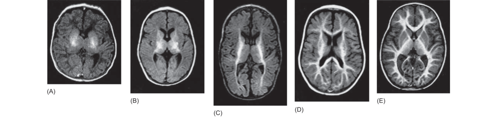
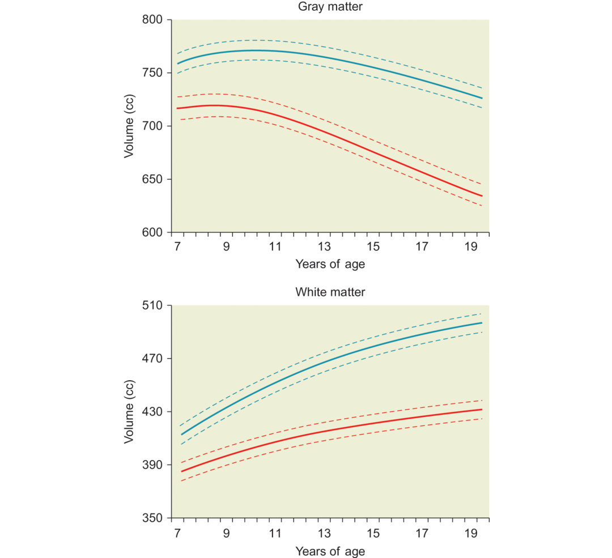

## Myelination

As you know, nerve cells are not the only cells in the brain; glial cells also play an important role in brain structure and function. We have already learned that certain types of glial cells form scaffolding during development that helps nerve cells find their way to distant destinations in the brain. Another very important role of glial cells is to provide the myelin sheath that coats axons in the brain. A baby’s brain is relatively unmyelinated, which means that it lacks the [oligodendrocytes](https://en.wikipedia.org/wiki/Oligodendrocyte) that insulate neurons. Therefore, brain regions cannot interact quickly in the infant.

如你所知，神经细胞不是大脑中唯一的细胞；胶质细胞也在大脑结构和功能中扮演了重要角色。我们已经学到了在发育过程中胶质细胞的特定类型形成了支架，它们可以帮助神经细胞找到通往大脑中目的地的路。胶质细胞的另一个重要功能是提供包裹轴突的髓鞘。一个婴儿的大脑是相对去髓鞘的，这意味着它缺少绝缘神经元的少突胶质细胞。因此，在婴儿中大脑区域交流得很快。

Myelination is a long, drawn-out process, with a developmental course that varies widely by region of the nervous system (Simmonds et al., 2014). Myelination first begins to appear between the fourth gestational month and the first year after birth (see Figure 15.5). Not surprisingly, the brain regions that are myelinated earliest in life, such as the spinal cord and the medulla, are those that support basic functions. During the first year after birth, basic sensory and motor systems become myelinated. Later in childhood, myelination occurs for connections between integrative systems, such as those connecting cortical and subcortical areas and those linking different cortical regions. For example, myelination of the **corpus callosum** continues through the teens into the early twenties (e.g., Lenroot et al., 2007; Thompson et al., 2000) as do long-range connections between different regions of the brain. The net result of all this myelination is that the relative amount of white matter increases during childhood and the teenage years while the amount of gray matter decreases (see Figure 15.6) (Brain Development Cooperative Group, 2012; Giedd et al., 2015).

髓鞘形成是一个漫长拖沓的过程，其发育过程因神经系统的区域各异。髓鞘化首先出现在妊娠期的第四月以及出生后的第一年。毫不奇怪，在生命早期髓鞘化大脑区域，例如脊柱和延髓，是支撑基本功能的部位。在出生后的第一年，基本的感觉和运动系统髓鞘化。在儿童期晚期，髓鞘形成发生在整合系统间的联系，例如那些连接皮质和皮质下区域以及那些连接不同皮质区域。例如，胼胝体的髓鞘发育的进行一直从青春期到20岁早期，大脑不同区域的长程连接也是如此。所有这些髓鞘发育的最终结果是在儿童期相对数量的白质增加以及在青春期灰质数量的减少。

Figure 15.5 Increased myelination of the brain during infancy.

In these figures, myelin appears in white. (A) 1-month-old infant; (B) at 2 months; (C) 3–6 months; (D) 7–9 months; (E) older than 9 months.

Figure 15.6 Between middle childhood and adulthood, gray-matter volume generally declines due to synaptic pruning, while white-matter volume increases due to myelination.

The figure also illustrates that brain volume is generally larger in boys (blue line) than in girls (red line) for both gray and white matter.
(from Lenroot et al., 2007)

The consequence of myelination is that brain regions become more structurally interconnected during development, up through adulthood (Dennis et al., 2013). This, in turn, results in increased communication between brain regions. It is as if the baby’s brain were connected by a series of old country roads meandering from town to town. This system doesn’t make for fast travel. Myelin transforms this infantile system into a faster one – the old country roads become regional highways, and even more myelin transforms them into national superhighways that can handle large volumes of traffic moving quickly. Faster transmission of neural signals can support quicker and more integrated perception, cognition, and action.

髓鞘形成的结果是在发育过程直到成年中大脑区域变得结构上更加连接。这，反过来，导致大脑不同区域的交流。婴儿的大脑就像通过一系列从一个镇子到另一个镇子弯曲曲折的老镇道路连接。这是系统不是为了快速旅行修建的。髓鞘把这个初步系统变成一个快速系统——老镇的路变成了区域告诉，甚至更进一步的髓鞘化把它们转变成过国家高速公路，可以处理大量快速移动的交通流量。神经信号的快速传递可以支持更快和更加整合的感知，认知和行动。
