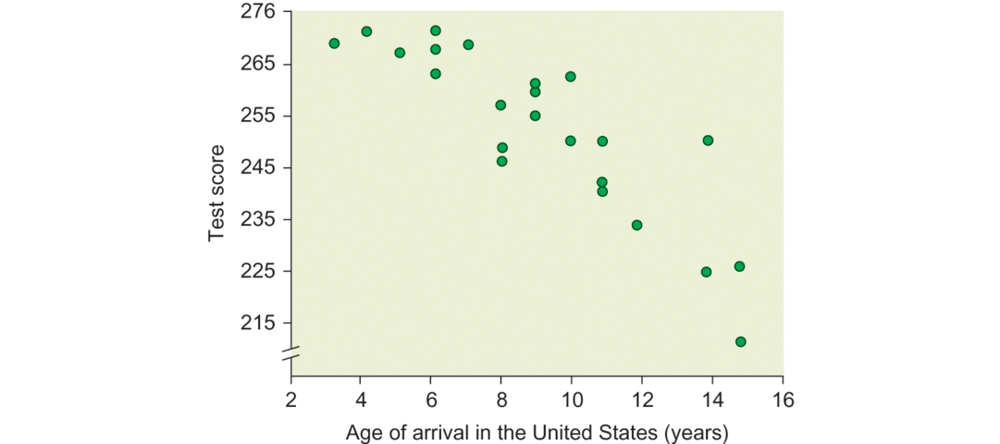

Deprivation of social contact during sensitive periods also affects neural and cognitive development. For example, one study found that socially isolating mice for a period of two weeks following weaning led to alterations in myelination and prefrontal cortex development (Makinodan et al., 2012). The isolated mice were unable to recover normal structure and function even when placed back in social environments. In humans, true social isolation is extremely rare, but studies of children raised in orphanage settings suggest that social deprivation in childhood is associated with alterations in white matter (Sheridan et al., 2012). Furthermore, the typical N170 ERP response to faces (see Chapter 6) is blunted in children who spent their early years in an orphanage, compared to noninstitutionalized children of the same age (Parker and Nelson, 2005; Parker et al., 2007). Children raised in institutional settings past the age of 2 appear to show more severe deficits in structure and function than those placed in family homes before the age of 2, implying a window of time in which [species-typical](https://en.wikipedia.org/wiki/Species-typical_behavior) social rearing is most critical (see Figure 15.9; e.g., Nelson et al., 2007).

在敏感时期剥夺社会联系也影响神经和认知发育。例如，一项研究发现在断奶后社交隔离两周的小鼠导致髓鞘形成和前额皮质发育的改善。隔离后的小鼠甚至不能在放回社会环境后恢复正常的结构和功能。在人类中，真正的社交隔离非常少，但是孤儿院长大的孩子表明儿童时期的社交剥夺与白质的变化有关。此外，典型的对面部具有的N170ERP响应（见第六章）在那些早年在孤儿院中度过的儿童相较于同龄没有在机构中度过的儿童变得迟钝。在机构中养育两岁的儿童表现得比那些在两岁前放在家庭中的儿童表现出更严重的结构与功能缺陷，表明**物种特有的**社会养育的时间窗口非常关键。

The development of language also involves a period of maximal sensitivity to input, demonstrating that higher cognitive functions also depend upon input at particular time periods (Friedmann and Rusou, 2015; Kuhl, 2010). For example, evidence from second-language acquisition supports the notion of a sensitive period for language development. If acquisition of a second language occurs before the ages of 5 to 7 years, the person’s competence will be equivalent to that of a native speaker (see Figure 15.10). For each year that passes after the age of 7 without exposure to the language, there is an incremental decline in the ability to understand the grammatical constructions of that language (Johnson and Newport, 1989; see also Gleitman and Newport, 2002; Newport et al., 2001). This pattern of results suggests that the ability to acquire a high degree of grammatical competence in a second language is limited by biological factors (see also Huang et al., 2014).

语言的发展也涉及一段最大敏感输入期，表明更高级的认知功能也依赖于特定时期的输入。例如，从第二语言习得的证据支持了语言发育有一段敏感时期的概念。如果第二语言习得发生在5到7岁前，则该人的能力将等同于母语者（见图15.10）。对于未暴露在语言环境后7岁后度过的每一年，理解该语言的语法构成的能力具有显著下降。这一结果模式表明，在第二语言中获取高度语法资质的能力受限于生物因素。

Figure 15.10 Sensitive period for acquiring grammatical competence in a second language.

The relationship between age of arrival in the United States and grammatical competence for individuals who arrive while between ages 3 and 15 years. With each year that passes after the age of five years, the ability to acquire grammatical competence decreases.

What specific biological mechanisms control the timing of the sensitive period for language acquisition? Currently the answer to this question is not known. Models of vocal communication in other species may provide some clues in the future. For example, many songbirds must be exposed to songs of their species within a critical window of development in order to learn those songs, and researchers have begun to identify neural processes that also change around the time that the critical period for song learning closes (Brainard and Doupe, 2013; Mooney, 2009). In humans, one model holds that the sensitive period for language learning opens due to the brain’s overall increasing computational power combined with the emergence of specific systems for social cognition that enable learning from others (Kuhl, 2010). The mechanisms for the closing of the sensitive period – that is, the biological factors that make it more difficult for adults to learn language compared to children – are still yet to be discovered.

什么具体的生物机制控制了对于语言习得的敏感时期的时间？当前对于这个问题的答案还不知道。其他物种的声音交流模型可能在未来提供了一些线索。例如，许多鸣禽必须在关键的发育窗口期暴露在他们物种的歌声下来学习这些歌声，并且研究人员已经开始甄别也可以改变歌声学习关键时期结束的时间点的神经过程。在人类中，一种模型认为语言学习的敏感期是由于大脑整体增长的计算能力与用于能够从他人学习的社会认知特定系统的出现开始的。关闭这些敏感时期的机制——即，使得成年人相较于儿童更难习得语言的生物因素——还没有被发现。

In sum, the development of the brain and behavior involves marvelously complex processes that unfold over a period of more than 20 years. Developmental processes in the brain include cell proliferation and migration, synaptogenesis, synaptic pruning, myelination, and alterations in functional connectivity, all of which take place over different time frames and at somewhat different rates in various brain regions. Some processes, such as cell migration, appear to progress relatively independently of environmental input. Others, such as synaptogenesis, synaptic pruning, and myelination, appear to be exquisitely sensitive to both the presence of species-typical environments ([experience-expectant effects](https://www.alleydog.com/glossary/definition.php?term=Experience-Expectant+Plasticity)) and the presence of specific and unique environments that the child encounters ([experience-dependent effects](https://www.alleydog.com/glossary/definition.php?term=Experience-Dependent+Plasticity)). Unfolding maturational processes combine with both universal and unique experiences at certain periods of development to produce a cognitively developed adult.

总的来说，大脑和行为的发育涉及在超过20年的期间展开的奇妙复杂的过程。大脑的发育过程包括细胞增殖和迁移，突出发生，突出修剪，髓鞘形成，和功能连接性的改变，所有的这些在不同的时间框架并且在不同的大脑区域以不同的速率发生。一些过程，例如细胞迁移，似乎是在环境输入中相对独立的。其他的，例如突出产生，突出修剪，髓鞘形成，似乎与**物种特有的**环境（**经验-预期效应**）以及儿童遇到的特定和独特环境（**经验-依赖效应**）非常敏感。逐渐展开的特定过程结合特定发育时期整体和独特体验产生了一个认知发育完成的成年人。
