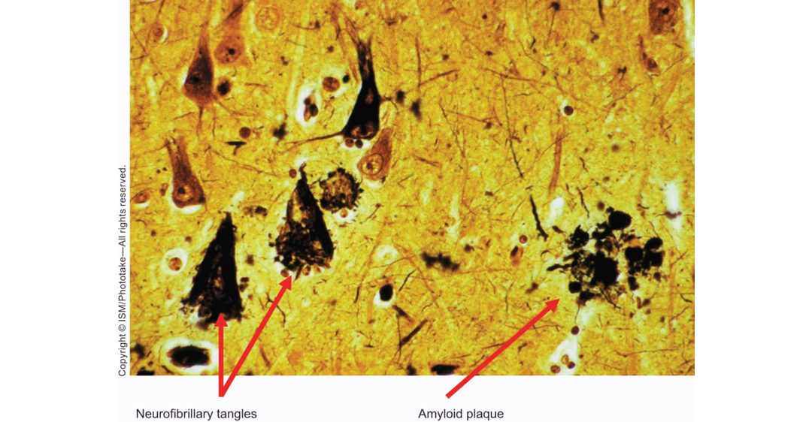

Neurophysiological Bases神经生理学基础

One of the main challenges in Alzheimer’s research is characterizing the pathological features of the brain and determining which of these features reflects the essential cause of the disorder. Great progress has been made in describing the pathology, but understanding of the causal chain that leads to the presence of these pathological features has been more elusive (for a review of Alzheimer’s pathology, see Perl, 2010).

阿尔兹海默症研究的主要挑战是描绘大脑的病理特征并确定哪一个特征反映了疾病的本质。描述病理特征已经取得了巨大的进展，但是对于导致这些病理特征的因果链的理解更加令人难以捉摸。

The defining neurobiological characteristic of Alzheimer’s disease is a brain riddled with large numbers of [neurofibrillary tangles and amyloid plaques](https://www.brightfocus.org/alzheimers-disease/infographic/amyloid-plaques-and-neurofibrillary-tangles). Neurofibrillary tangles are twisted pairs of helical filaments found within the neuron (see Figure 16.5). They are similar to but distinct from microtubules, which are normal cell structures that allow neurotransmitters and other proteins made within the cell body to be transported to other regions of the cell. Because of their structure, neurofibrillary tangles are thought to disrupt a neuron’s structural **matrix**. Although these tangles can be found in the brain of the average healthy older individual, they are found in greatly increased numbers in the cortex of an individual with Alzheimer’s disease.

阿尔兹海默症定义了的神经生物学特征是一个被大量神经原纤维缠绕和淀粉样蛋白班。神经原纤维缠结是在神经元内发现的双螺旋细丝（见图16.5）。他们与微管类似但是和微管不同，微管是正常的细胞结构允许神经递质和其他细胞体内的蛋白转移到细胞的其他区域。因为它们的结构，神经原纤维缠结被认为干扰了神经元的结构基质。虽然这些缠结可以在普通健康老人的大脑中发现，但是它们在患有阿尔兹海默症的患者中发现得更多。

Figure 16.5 Neurofibrillary tangles and plaques that are typically observed in Alzheimer’s disease.

Shown here is a section of cortex from a patient with Alzheimer’s disease. The neurofibrillary tangles are the dark cone-shaped objects, and the plaques are the brown clumps.

Source: ISM/Phototake.

Neurofibrillary tangles are not equally distributed throughout the brain: they show an affinity for medial temporal, inferior parietal, and frontal regions, while sparing primary motor and sensory areas. Anatomical research has shown that tangles and plaques are first noted in the regions at the base of the brain along the midline, and they seem to spread out from there (Mesulam, 2013). This pattern has led some researchers to suggest that whatever destructive process affects people with AD appears to propagate across the brain. However, because large numbers of neurofibrillary tangles are also observed in other neurological conditions such as Down syndrome, [dementia from boxing](https://www.seniorliving.org/health/dementia/pugilistica/), and Parkinson’s disease resulting from [encephalitis](https://www.mayoclinic.org/diseases-conditions/encephalitis/symptoms-causes/syc-20356136), their role in causing AD is still uncertain.

神经原缠结在大脑中并不均匀分布：它们对内侧颞叶，下顶叶和额叶区域显示亲和力，同时初级运动和感觉区域幸免。解剖研究已经显示，缠结和斑块首先在大脑沿着中线的底部被发现，并且它们看起来从那里扩散开来。这个模式导致一些研究者认为无论破坏过程如何影响患有AD的人似乎都会沿着大脑传播。然而，因为大量的神经原缠结在其他神经学上的条件，例如唐氏综合征，拳击手痴呆症和脑炎引起的帕金森病，它们在AD中的作用仍不确定。

Amyloid plaques are deposits consisting of [aluminum silicate](https://www.sciencedirect.com/topics/materials-science/aluminum-silicate) and amyloid peptides, meaning that they are basically a buildup or a conglomeration of proteins (Figure 16.5). These plaques often include [tau protein](https://www.ncbi.nlm.nih.gov/pmc/articles/PMC5390006/) and apolipoprotein E ([ApoE](https://ghr.nlm.nih.gov/gene/APOE)), which, as we will soon learn, are implicated in the genetic aspects of Alzheimer’s disease. The plaques, typically surrounded by neurons containing neurofibrillary tangles, are believed to cause vascular damage and neuronal cell loss. The accumulation of tau protein appears to be especially important in contributing to cell death, so intense research has focused on attempting to understand the molecular mechanisms of tau accumulation (Spires-Jones et al., 2009).

淀粉样蛋白是由硅酸铝和淀粉样多肽组成的沉积物，意味着它们基本上是蛋白质的累积或凝块（图16.5）。这些斑块通常包括tau蛋白和载脂蛋白E（ApoE），正如我们将会马上学到的，这些斑块与阿尔兹海默症的遗传有关。通常由有神经原纤维缠绕的神经元环绕的斑块被认为是引起血管损坏和神经细胞丢失的原因。tau蛋白的累积在促使细胞坏死中起到特别重要的作用，因此密集的研究已经聚焦于尝试理解tau累积的分子机制。
