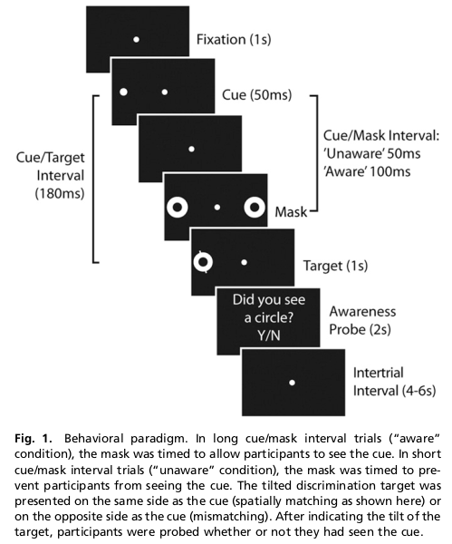
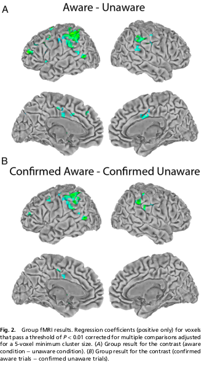
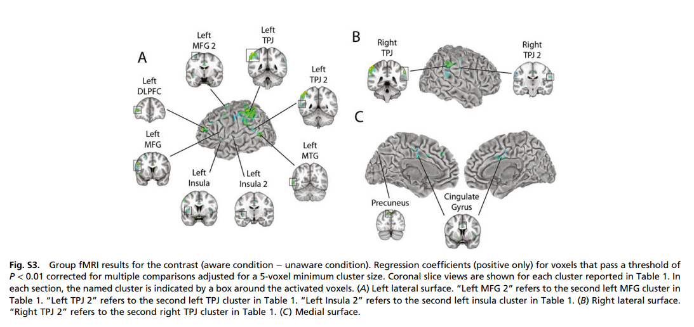

# Cortical networks involved in visual awareness independent of visual attention

TPJ:temporalparietal junction
DLPFC:dorsolateral prefrontal cortex
IS:inferior-superior
LR:left-right
MFG:middle frontal gyrus
MTG:middle temporal gyrus
PA:posterior-anterior

We looked for brain regions that were more active in the aware than the unaware trials. The largest cluster of activity was obtained in the **temporoparietal junction (TPJ)** bilaterally. **Local independent component analysis (ICA)** revealed that this activity contained three distinct, but overlapping, components: a bilateral, anterior component; a left dorsal component; and a right dorsal component.

**Graph1 of Figure1**

While the subject fixated centrally, a briefly presented (50 ms) cue (a white spot on a black background) was used to draw attention to the left or right of fixation.

**Graph2,3 of Figure1**

The cue was followed by metacontrast masks, white rings whose inner diameter matched the outer diameter of the cue. These masks appeared either 50 ms after cue onset or 100 ms after cue onset. These intervals were selected with the aim of making participants **unaware of the cue in one condition (50 ms)** and **aware of the cue in the other condition (100 ms)**. 

**Graph4 of Figure1**

The masks always appeared on both sides of fixation to prevent biasing attention to one side. 

**Graph5 of Figure1**

Following the masks, 180 ms after cue onset, a target stimulus was added to one of the mask rings, either on the right or the left of fixation. **The location of the cue did not predict the location of the target.** The target consisted of a line through the mask ring. 

**Graph6,7 of Figure1**

Participants were asked to indicate as quickly as possible, by button press, **whether the line was tilted left or right**. Participants performed this task with a mean accuracy of 84% (SD = 12%) and a mean latency of 712 ms (SD = 124 ms). 

Participants were then asked to indicate, by button press, **whether they had been aware of a cue on that trial (awareness probe)**. (See Supporting Information for a discussion of separating the cue from the target and a discussion of oddball effects.)

## Distinguish 'aware' and 'unaware'
1/3 no cue false-positive rate(mean=18%,SD=14%)
2/3 cue true-positive rate
	50ms(mean=27%,SD=15%)
	100ms(mean=80%,SD=13%)

| TP | true positive | 正确的阳性，说明预测是阳性，而且预测对了，那么实际也是正例。|
| TN | true negative | 正确的阴性，说明预测是阴性，而且预测对了，那么实际也是负例。|
| FP | false positive | 假阳性，说明预测是阳性，预测错了，所以实际是负例。|
| FN | false negative | 假阴性，说明预测是阴性，预测错了，所以实际是正例。|

## faster response matters?

speeds processing of a subsequent target at that location and slows processing of targets at different locations. Thus, target response latencies should be 

* faster when the target appears at the same location as the cue (aligned trials), and 

* slower when the target appears at the opposite location as
the cue (misaligned trials).

Δt = (latency when target and cue are misaligned − latency when target and cue are aligned)

* aware condition: Δt = 25 ms; SD = 28, significantly above 0; t = 4.5; P = 0.0001

* unaware condition: Δt = 17 ms, SD = 31, significantly above 0; t = 2.8; P = 0.01

There was also no significant difference in discrimination accuracy between the aware and unaware conditions (planned comparison, paired t = 0.65; P = 0.52), indicating that **the two conditions were balanced for task difficulty**.

### 

Fig. 2A shows the result of the contrast (aware condition − unaware condition).

#### metaconstrast masking may not perfect
the metacontrast masking manipulation did not perfectly separate trials into “aware” and “unaware” conditions.

To address this concern, we performed a separate analysis in which the data set was restricted to 

* the 80% of long cue/mask interval trials on which participants reported being aware of the cue, and

* the 73% of short cue/mask interval trials on which participants reported being unaware of the cue. 

We refer to these as **“confirmed aware”** and **“confirmed unaware”** trials.

## Futures

[MNI coordinates](https://neuroimage.usc.edu/brainstorm/CoordinateSystems#MNI_coordinates)
