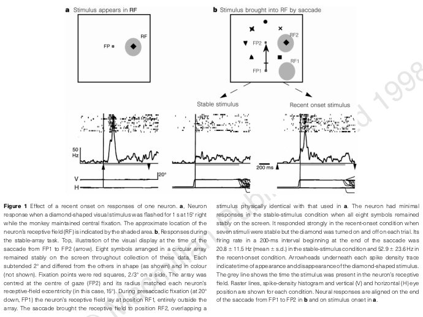
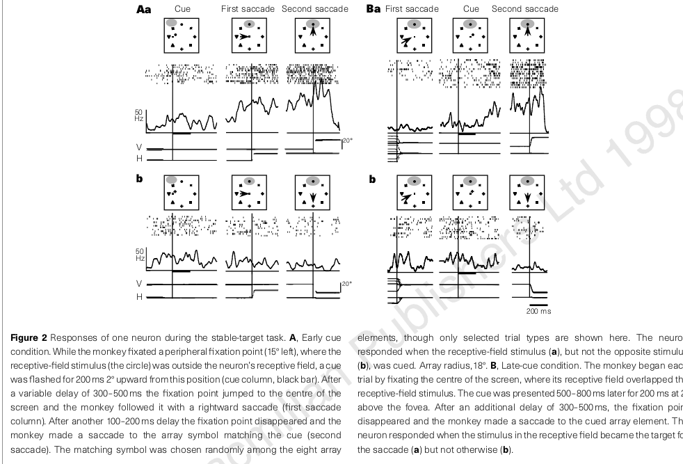
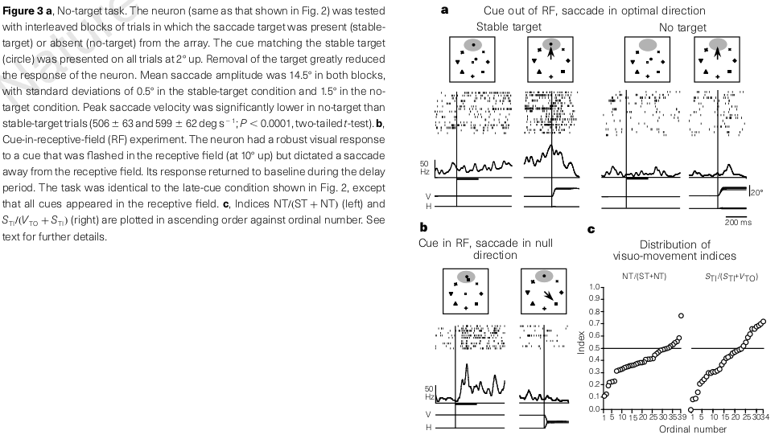

# Neuronal Mechanisms of Attentional Control: Parietal Cortex

the monkey parietal lobe has been subdivided into two broad
sectors that lie dorsal and ventral to the intraparietal sulcus (IPS) and are called the superior and inferior parietal
lobes (SPL and IPL)

Areas within the SPL are responsive primarily to 

* touch (somatosensation) and skeletal(limb) movements and 

* represent the near peripersonal space (Colby and Goldberg 1999), 

while areas in the IPL respond to 

* visual inputs and movements of the eyes and head and 

* represent the farther visual space (Colby and Goldberg 1999)

The IPL, which has been most intensively studied in relation to attention, is further subdivided into three areas

* VIP (the ventral intraparietal area)

* Area 7a

* lateral intraparietal area (LIP)

Area LIP has been intensively investigated and is believed to reflect internal
processes related to attention, learning, and decision formation

## The representation of visual salience in monkey parietal cortex

We have tested the responses of LIP neurons to stimuli that entered their receptive field by saccades.

Neurons had little or no response to stimuli brought into their receptive field by saccades, unless the stimuli were behaviourally significant. 

We established behavioural significance in two ways: 

* either by making a stable stimulus task-relevant,

* or by taking advantage of the attentional attraction of an abruptly appearing stimulus.

Our results show that under ordinary circumstances the entire visual world is only weakly represented in LIP. The visual representation in LIP is sparse, with only the most salient or behaviourally relevant objects being strongly represented.

(LIP neurons have a remarkable ability to filter out most objects in rich visual scenes and selectively respond to salient locations, and they track these locations across shifts of gaze.)

### Three stimulus

#### Figure 1

The visual responses and receptive field of each neuron was first assessed in a passive visual task in which visual stimuli were flashed during stationary fixation

**Stable target task**

In each trial a peripheral fixation point appeared (FP1 in Fig. 1b), situated such that no member of the array was in the receptive field when the monkey fixated it. This fixation point then stepped to the centre of the array (FP2 in Fig. 1b), and the monkey followed it with a saccade.

**Recent-on target task**

In this variant only seven array symbols remained stably on the screen, and the eighth, the one that will enter the receptive field, was turned on anew in each trial while the monkey fixated the peripheral fixation point. After 500 to 2,000 ms, the monkey made a saccade that brought this recently appeared stimulus into the receptive field.

These results demonstrate that the visual responses of LIP neurons are not simply due to the entry of a visual stimulus onto an appropriate retinal location. Instead, they are critically dependent on the abrupt onset of that stimulus, which renders it salient.  Recently appeared visual stimuli are represented in LIP even when they appear outside the receptive field and are brought onto it by a saccade, whereas stable stimuli evoke only weak or no responses.

#### Figure 2

The monkey first fixated a peripheral fixation point, and then a cue appeared (outside the receptive field) that matched one member of the array (Fig. 2a). The monkey made a first saccade to the centre of the array, thereby bringing at least one array stimulus into the receptive field, and a second saccade to the cued array element, chosen pseudorandomly on each trial.

When the cue informed the monkey that the second saccade would be to the stimulus entering the receptive field, the neuron discharged, starting around the first saccade and continuing until after the second saccade (Fig. 2Aa). 

In contrast, when the cue matched a stimulus outside the receptive field, the neuron did not respond, even though the same array stimulus entered the receptive field by means of the first saccade (Fig. 2Ab)

#### Figure 3

We hypothesized that the responses in the stable-target tasks were related to the significance of the stimulus present in, or entering, the receptive field. However, LIP neurons are also known to have spatially selective presaccadic motor activity in the absence of recent visual stimulation 5 . To determine whether this presaccadic activity could fully explain the response in the stable-target task, we trained the monkey to make saccades into the receptive fields of the neurons in the absence of current or recent visual stimulation of the receptive field.

Consistent with previous findings, therefore, although some neurons have an independent saccade-related response, much of their presaccadic activity reflects the location of a selected visual stimulus rather than the planning of the saccade itself.

