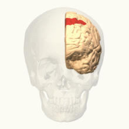
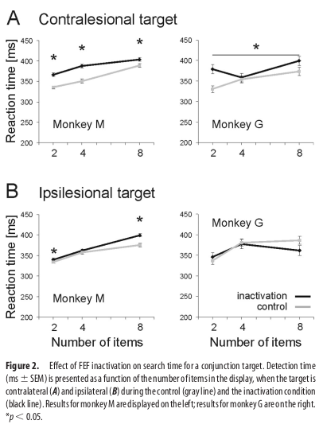
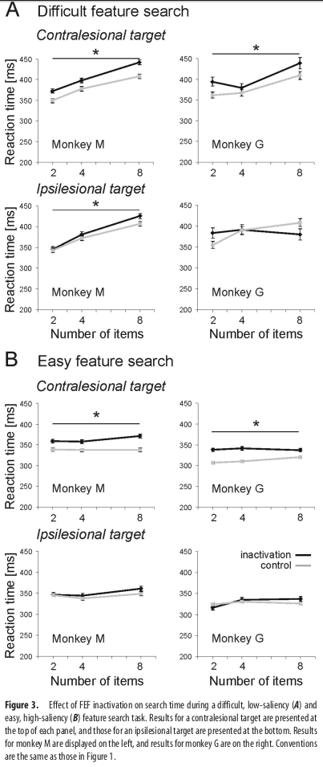
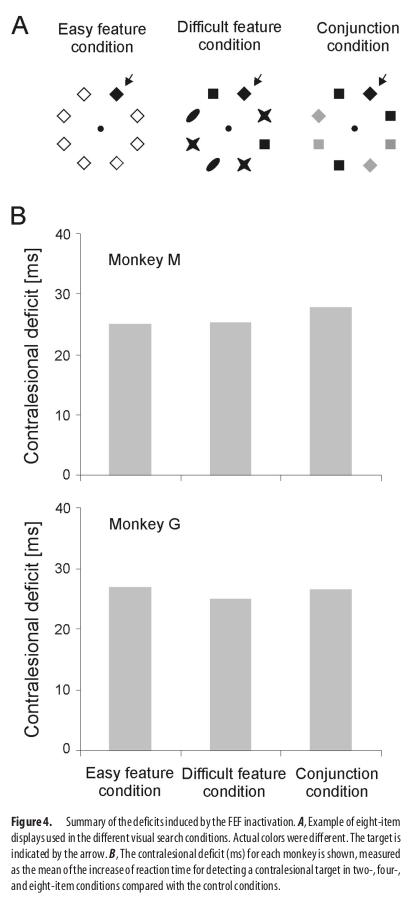

# Contribution of the Monkey Frontal Eye Field to Covert Visual Attention

the FEF may also play a role in orienting attention. 

To address this issue, we reversibly inactivated the FEF using multiple microinjections of muscimol, a GABA A agonist, in two macaque monkeys performing visually guided saccades to a single target. 

The effects of FEF inactivation were also studied in a covert visual search task that required monkeys to search for a target presented among several distractors without making any eye movements.

As expected, inactivating the FEF caused spatially selective deficits in executing visually guided saccades, but it also altered the ability to detect a visual target presented among distractors when no eye movements were permitted. These results allow us to conclude definitively to an involvement of the FEF in both oculomotor and attentional functions.

## 残忍地对待小猴

Two adult monkeys (Macaca mulatta monkey M and Macaca fascicularis monkey G) weighing ⬃6 kg were used in these experiments following procedures approved by the local animal care committee, in compliance with the guidelines of European Community on Animal Care. Each monkey underwent a single surgical session under propofol anesthesia to prepare for chronic recording of eye movements and extracellular recording within the frontal cortex. The animals were implanted with scleral search coils (Judge et al., 1980) and a head restraining device. A craniotomy was made over the left arcuate sulcus, and a stainless-steel recording chamber was implanted to allow access to FEF with microelectrodes and injection needles.

## Behavioral tasks

Monkeys were trained to perform 

* a visually guided saccade task

In the **visually guided saccade paradigm**, monkeys were required to maintain fixation for 1000 –1600 ms until the fixation point disappeared. 

At this time, a visual target appeared at one of eight possible locations (10° of eccentricity, radially distributed about the fixation point at 45° intervals) in randomly interleaved order.

The monkeys received a liquid reward if they made a saccade toward the target within 1000 ms of its appearance and maintained fixation there for at least 500 ms.

* a covert visual search task

The **covert visual search task** required the monkey to maintain fixation on a small spot of light at the center of the projection screen and search, while keeping their eyes on the fixation point, in the visual periphery for the presence of a **predefined target** in an array containing two, four, or eight items.

A trial **started when the monkey’s hand was in contact with the lever** and then the central fixation point appeared.

From 300 –1000ms after the foveation of the fixation point, up to three visual search displays appeared in succession, each lasting 200 ms, separated by a 1000 ms blank interval (see **Fig. 1 B**). 

The monkeys had to press the lever within 900 ms after the appearance of a display, which contained the target.

If no target was present, the monkeys refrained from responding and waited for the next display without breaking fixation. 

The target appeared in the first, second, or third display with equal probability, hence pressing the lever at random would result in 33.3% of correct answers. 

Trials were interrupted if the monkey pressed the lever when no target was present or failed to maintain fixation. Both monkeys used their right hand to answer.

###  test for a possible visual deficit induced by FEF inactivation(robust check)

Within a given trial, successive displays contained the same number of items, but the number of items per display varied randomly from one trial to the next. In most experiments, the visual items were circularly distributed at 10° of eccentricity, half on the left side and half on the right side of the fixation point. However, for some control conditions tested in monkey M, the visual items were aligned vertically on either side of the fixation point. The two lines were either at 3.5 or 7° of the midline (tested in block), and the furthest item was located at 10° of the fixation point. 

In a final control task performed by both monkeys, a single stimulus was presented at a random delay ranging between 300 and 1000 ms after foveation of the fixation point and at either 10° right or 10° left of the fixation point on the horizontal meridian. This stimulus was identical to the target used in the visual search task. The monkeys indicated its appearance by a manual response. 

This control was designed to test for a possible visual deficit induced by FEF inactivation, outside the context of visual search and in the absence of competition for attention.

## Visual Stimuli

In **the saccade task**, both the fixation point and the saccadic target consisted in a gray cross

For **the visual search task**, the fixation point was also a gray cross. The target was a pink diamond shape.

The basic visual search array tested in both monkeys was the detection of a conjunction target identified by a specific combination of two visual features, one shape and one color. The other combinations constituted the distractors (orange diamond, pink star, and orange star).

Two additional conditions were tested in which the target differed from the distractors by single visual feature. 

In the **difficult feature search condition**, the distractors were heterogeneous and consisted of three different shapes of the same color as the target (pink).

In the **easy feature search condition**, there was only one distractor type of the same shape as, but different color from, the target (a blue diamond).

## FEF localization

In one monkey (monkey M), the FEF was first located by using single-cell recordings.

The localization of the FEF was confirmed in monkey M and determined in monkey G by using electrical microstimulation in anesthetized monkey.

## Results

