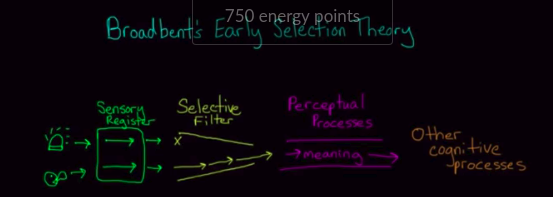
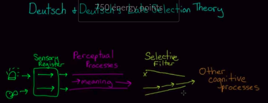
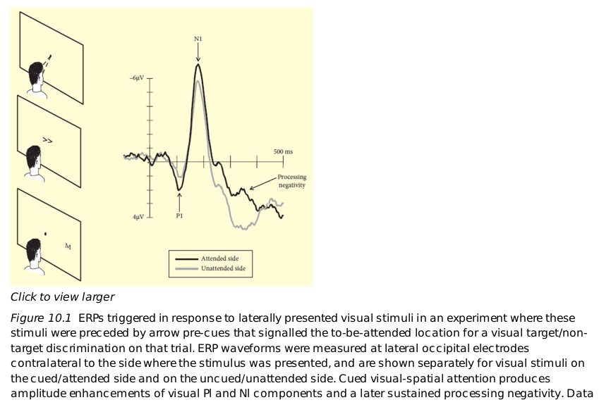
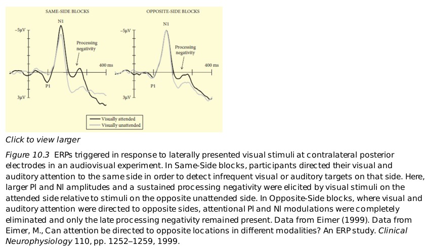
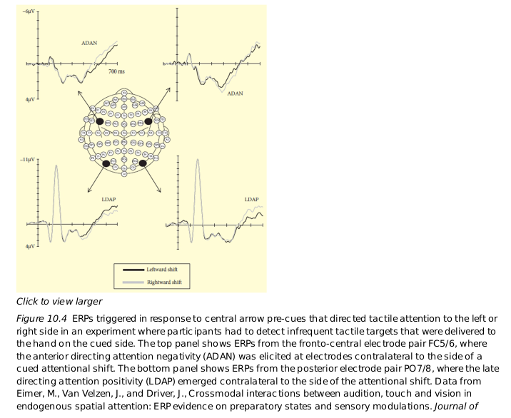
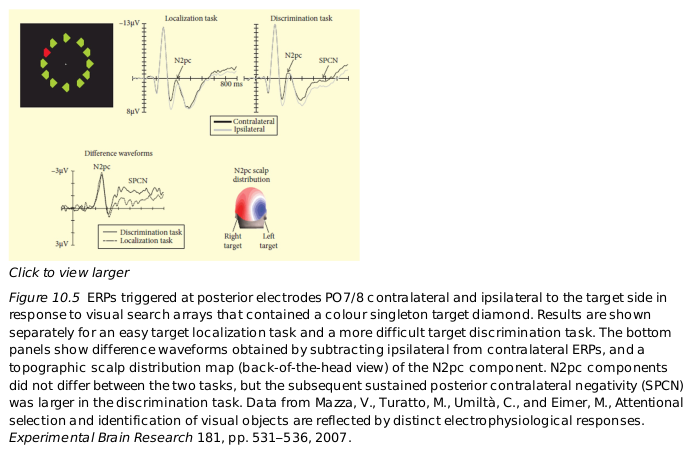

# Dicussion in 2019-4-8

## preparation

[selective-attention-KhanAcademy](https://www.khanacademy.org/science/health-and-medicine/executive-systems-of-the-brain/attention-language-lesson/v/selective-attention)

attenuator:衰减器（与之前一样的内容，注意到的越来越弱）
争论发生在，"多长时间"上能证明这一点

[ERP-wikipedia](https://en.wikipedia.org/wiki/Event-related_potential)

* ERP（EEG）适合快速反应，时间上精确，空间不准确
fMRI等 适合空间精确，时间不准确

* ERP是EEG多次的平均

* N1，N100
	
	N100 (indicating its latency is 100 ms after the stimulus and that it is negative) or N1 (indicating that it is the first peak and is negative)

* 

[filter-model-wikipedia](https://en.wikipedia.org/wiki/Broadbent%27s_filter_model_of_attention#Late_selection_models_of_attention)

[C1 and P1](https://en.wikipedia.org/wiki/C1_and_P1_(neuroscience))

## paper
The Time Course of Spatial Attention: Insights from Event-Related Brain
Potentials, Eimer, 2014

### About figure 10.1

枕叶记录
80ms P1

P1 由于先前提示的信息导致感官地注意
N1 对某个位置的注意
200ms后的认为是察觉后的处理过程

Early认为100ms内触发了C1，已经完成了选择

Late认为100ms触发C1正是并行传导的过程

AB experiments

