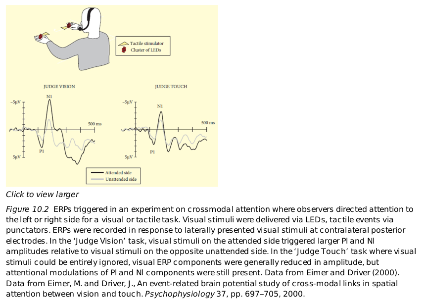

# Dicussion in 2019-4-8

## preparation

[selective-attention-KhanAcademy](https://www.khanacademy.org/science/health-and-medicine/executive-systems-of-the-brain/attention-language-lesson/v/selective-attention)

[ERP-wikipedia](https://en.wikipedia.org/wiki/Event-related_potential)

[filter-model-wikipedia](https://en.wikipedia.org/wiki/Broadbent%27s_filter_model_of_attention#Late_selection_models_of_attention)

## paper
The Time Course of Spatial Attention: Insights from Event-Related Brain
Potentials, Eimer, 2014

