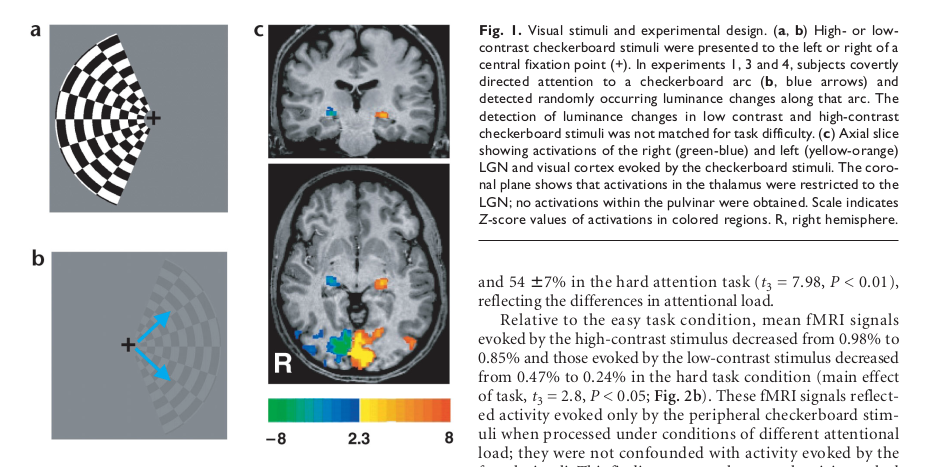
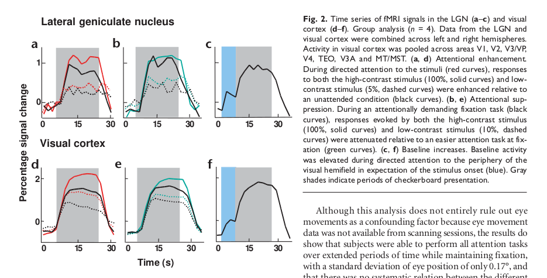

# LGN and Pulvinar

Only one side

## LGN

### inputs

In addition to retinal afferents that form only a minority of the input to the LGN, it receives projections from multiple sources including primary visual cortex (V1), the TRN(reticular nucleus), and brainstem.

### six main layers

The four dorsal layers contain small (parvocellular) neurons that are characterized by **sustained discharge patterns** and **low contrast sensitivity**, largely processing **form and colour** information. 

The two ventral layers contain large (magnocellular) neurons that are characterized by **transient discharge patterns** and **high contrast sensitivity**, largely processing **motion and depth** information.

### O’Connor et al. (2002) 
	
	It showed that selective attention affects visual processing in at least three different ways, similar to the modulatory effects observed in visual cortex: 

by enhancing responses to attended relative to ignored stimuli, 
   
by suppressing responses evoked by unattended stimuli,
   
by increasing baseline activity in the absence of visual stimulation and in anticipation of an upcoming stimulus

#### Enhancement of responses to attended stimuli

To investigate attentional response enhancement in the LGN (experiment 1), checkerboard stimuli of high- or low-contrast were presented to the left or right hemifield while subjects direct-ed attention to the stimulus (attended condition) or away from the stimulus (unattended condition) in separate runs. In the unattended condition, subjects counted letters at fixation, which directed attention away from the stimulus. **The letter-counting task ensured proper fixation and effectively prevented subjects from covertly attending to the checkerboard stimuli** . In the attended condition, subjects were instructed to covertly direct attention to the checkerboard stimulus and to detect luminance changes that occurred at random times and at 10° eccentricity (Fig. 1b). Behavioral performance was 59 ± 1% correct (mean ± s.e.m.) for letters and 76 ± 29% for luminance changes.

#### Suppression of responses to ignored stimuli

To investigate attentional load–dependent suppression in the LGN (experiment 2), high- and low-contrast checkerboard stimuli were presented to the left or right hemifield while subjects performed **either an easy or difficult attention task at fixation and ignored the peripheral checkerboard stimuli**. During the easy attention task, subjects counted brief, infrequent color changes of the fixation cross. During the hard attention task,subjects counted letters at fixation as in experiment 2. Behavioral performance was 99 ± 1% correct in the easy attention task and 54 ± 7% in the hard attention task (t 3 = 7.98, P < 0.01),reflecting the differences in attentional load.

Relative to the easy task condition, mean fMRI signals
evoked by the high-contrast stimulus decreased from 0.98% to
0.85% and those evoked by the low-contrast stimulus decreased
from 0.47% to 0.24% in the hard task condition (main effect
of task, t 3 = 2.8, P < 0.05; Fig. 2b)

#### Attention-related increases of baseline activity
To investigate attention-related baseline increases in the LGN (experiment 3), subjects were cued to covertly direct attention to the periphery of the left or right visual hemifield and to expect the onset of the stimulus. **After the expectation period, during which subjects attended to the periphery without receiving visual input, a high-contrast checkerboard was presented at the expected location.** During the attended presentations, subjects counted the occurrence of luminance changes, as in experiment 1. During the expectation period, fMRI signals increased by 0.3% relative to the preceding blank period in which subjects were fixating but not directing attention to the periphery (main effect of expectation versus blank period: t 3 = 6.4, P < 0.01)

[Talairach coordinates](https://en.wikipedia.org/wiki/Talairach_coordinates)
