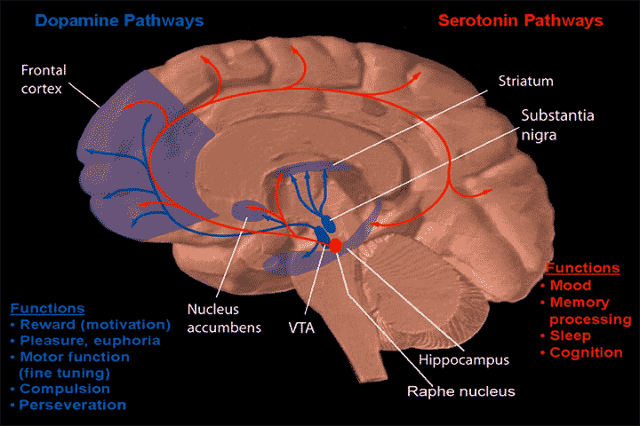

<table>
  <tr>
    <td>It is tempting to refer to the reward pathway as the “pleasure center” of the brain, but caution is required. Just because an animal presses a lever repeatedly for stimulation, does that mean the animal gets pleasure from it? It is important to dissociate “wanting” something from actually “liking” it. This distinction is clear in research on addiction, which has demonstrated that addicts may go to great lengths to obtain a drug (i.e., wanting it), but no longer experience pleasure once they take it (i.e., liking it; Robinson et al., 2015). Some researchers have proposed that the dopaminergic path leading to the core of the **nulceus accumbens** is not responsible for pleasure itself, but for the “wanting” aspects of reward-related behavior – those aspects that propel an animal toward desired goals (Berridge and Robinson, 1998, 2003). In contrast, only a certain part of the **nulceus accumbens** – specifically, a layer of cells surrounding the **accumbens** and referred to as the **nulceus accumbens** shell – is thought to underlie the sensation of consummatory pleasure upon achieving a desired goal; that is, the “liking” (see Figure 12.8) (Berridge, 2003; Castro and Berridge, 2014; see also Baliki et al., 2013).</td>
    <td>把奖励通路当为大脑“快乐中心”的想法很有吸引力，但是同时也需要警惕这个想法可能带来的谬误。仅仅因为一个动物由于刺激而重复按压杠杆，就意味着动物从这个行为中得到快乐？从实际上“喜欢”一个东西的行为中解离出“想要”一个东西的行为是非常重要的。这个区别在研究成瘾问题中得到了很好的体现，在这些研究中显示成瘾的人会走很长的路来拿到毒品（即，想要毒品），但是当他们拿到毒品时便不会有快乐之感（即，喜欢它）。一些研究者提出多巴胺通路到伏隔核的中心并不负责快乐本身，但是负责与奖励相关的行为中“想求”的方面，“想求”方面是指推动动物向渴求的目标前进。相反，只有伏隔核的某些部分是被认为在达到渴求目标后所带来极乐之感的基础；也即，喜欢。具体来说，伏隔核的某些部分是指一层包裹在伏隔周围的细胞，也就是伏隔核壳。</td>
  </tr>
  <tr>
    <td>Many studies of the reward pathways have focused on nonhuman animals, but neuroimaging studies have also examined the conditions that activate the **nulceus accumbens** in humans. The **accumbens** becomes activated in people when they receive a reward, especially when the reward is unexpected (Berns et al., 2001). In situations with predictable rewards, the **accumbens** is activated when the person anticipates the reward before actually receiving it (Knutson et al., 2001). These results suggest that the **accumbens** is initially sensitive to unexpected rewards; however, as a pattern of rewards emerges, the **accumbens** begins to anticipate the reward (see also Fiorillo et al., 2003; Hollerman and Schultz, 1998).</td>
    <td>诸多关于奖励通路的研究都聚焦在非人动物上，然而神经成像研究也检验了人类中激活伏隔核的条件。当人们获得奖励时，特别是所得奖励是未预料到的情况下，伏隔核变得活跃。在预料到的奖励时，伏隔核在人们实际收到奖励前，期望获得奖励的时候就已经被激活了。这些结果表明，伏隔核在初始时对未预料到的奖励敏感；然而，随着奖励模式的浮现，伏隔核便开始能够预料到奖励的内容。</td>
  </tr>
  <tr>
    <td>Evidence generally indicates that there is one basic brain system that processes rewards, regardless of the specific nature of those rewards (Berridge and Kringelbach, 2015). For example, the **nulceus accumbens** is activated by a variety of stimuli that could be considered rewarding, such as sweet juice, money, and attractive faces (e.g., Aharon et al., 2001; Berns et al., 2001; Kampe et al., 2001; Knutson et al., 2000). This region is also activated by rewarding items that are addictive. For example, smokers show greater **accumbens** responses to smoking-related imagery than do nonsmokers (David et al., 2005). For obvious reasons, clinically oriented research on the ventral striatum has centered on its role in addiction, to which we will return in Chapter 14.</td>
    <td>证据通常表明存在一个基础的处理奖励的大脑系统，这个系统与奖励的具体性质无关。例如，伏隔核由多种可以被认为是奖励的刺激激活，例如，甜甜的果汁，钱以及好看的面孔。这个区域也可以由有成瘾性的奖品。例如，吸烟的人相较于不吸烟的人的伏隔核对于与吸烟有关的图像。由于众所周知的原因，临床上关于腹侧纹状体的研究关注伏隔核在成瘾行为中所扮演的角色，关于这些将会在第十四章中涉及。</td> 
  </tr>
</table>

