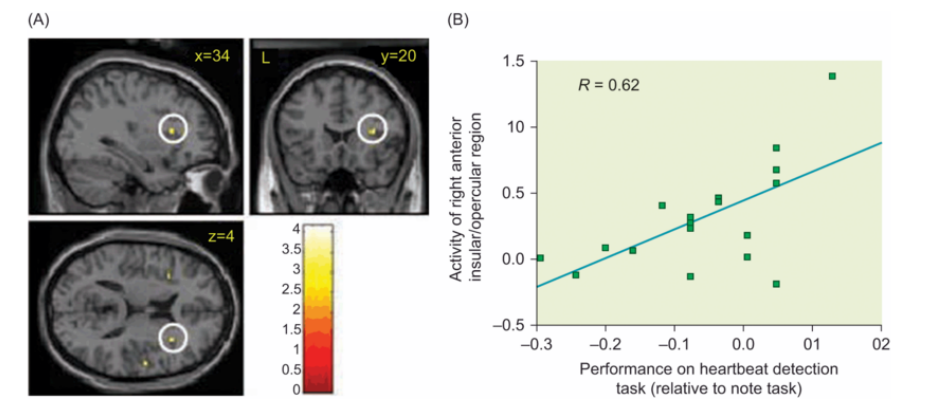

The anterior insula appears to be critically involved in representing the body’s internal states. One study of the insula’s role in interoception examined participants’ ability to detect their own heartbeats (Critchley et al., 2004). The researchers found that activation was enhanced in the anterior insula during this task, compared to a control condition that involved detecting external stimuli (see Figure 12.10). In addition, people who were more accurate at detecting their own heartbeats had a right anterior insula that was both bigger and more active compared to people with poor accuracy at the task. These data imply that the insula plays an important role in encoding interoceptive cues.

前脑岛似乎与表示身体内部状态紧密联系。 一项有关脑岛在内感受中作用的研究考察了被试检测自己心跳的能力。 研究人员发现，相较于涉及检测外部刺激的控制条件的情况下，在检测自己心跳任的务期间前脑岛的活动得到增强（见图12.10）。 此外，那些更准确地检测自己心跳的人的右前脑岛与那些任务准确性差的人相比，更大更活跃。 这些数据意味着脑岛在编码内感受线索中起着重要作用。

Whereas some research indicates that the insula is important in representing a variety of internal bodily cues of emotion, other research emphasizes its special role in the emotion of disgust. Interestingly, research with nonhuman primates indicates that part of the insula serves as the primary gustatory (taste) area. What does taste have to do with emotion? One clue is provided by the term disgust, which literally means “bad taste.” Though disgust is a sensation that we associate with rotten food or foul odors, the term has broader significance as well. As Charles Darwin noted, the facial expressions we make in situations of moral repulsion are the same as those we make when recoiling from disgusting food (Darwin, 1873). Researchers have confirmed Darwin’s observation by demonstrating that the same facial expression muscles (levator labii muscles) were activated when people tasted unpleasant liquids, viewed photographs of contaminants such as feces or insects, or experienced unfair treatment in a social game (Chapman et al., 2009).

与此同时，一些研究表明脑岛在表示多种情绪的内在身体线索，另一些研究强调其在厌恶情绪上的特殊角色。有趣的是，一些非人灵长类的研究表明脑岛的一部分是作为基本的味觉区域。味觉与情绪有什么关系呢？一条线索是由作呕（fill with distaste）引出的，直白地讲就是“坏的味道”所引出的。虽然作呕是一种与腐烂食物或者馊味联系起来的，这个词也有更广泛的含义。查理斯.达尔文记录道，我们在精神排斥的情况下的面部表情是和我们在躲避令人作呕的食物时一样的。研究者通过展示在人们在品尝不好喝的液体时，看有污物（例如粪便或昆虫）的照片或者在社交游戏中经受不公正的待遇时具有相同面部表情的肌肉活动证实了达尔文的观察。

Figure 12.10 Activation of the insula during an interoceptive judgment task.
Participants had to determine whether a series of tones matched their own heartbeat. Those who performed better at the task (compared to performance on a control task involving detection of notes) had more activity in the right insula. Panel A shows the right insula region (in white circle) and panel B shows the correlation between activity in that region and performance.

被试需要在一系列节奏中确定与他们心率相合的节奏。那些在这个任务上表现好的（相较于控制任务中检测音律的表现）在右脑岛有更多的活动。A展示了右脑岛区域（白圈），B展示了在那个区域中的活动和表现的关系。

Several lines of research link the insula to disgust. Early studies performed during brain surgery found that stimulation of the insula in humans elicited sensations of unpleasant taste and nausea (Penfield and Faulk, 1955). Neuroimaging studies show that this area is sensitive to processes related to feeding, such as odor, taste, tongue stimulation, swallowing, thirst, and hunger (Small et al., 2001). Damage to the insula interferes with both the experience of disgust and the ability to recognize facial expressions of disgust in others (Calder et al., 2000; Woolley et al., 2015).

多个研究将脑岛与厌恶联系起来。在脑科手术中产生的早期研究发现对脑岛刺激减轻了不愉快味道和晕船的感受。神经影像学研究表明这个区域与处理有关吃饭的活动，例如气味、味道、舌头刺激、吞咽、口渴和饥饿有关。脑岛的损坏会干扰厌恶的感受和识别其他人厌恶的面部表情的能力。

Likewise, neuroimaging studies have demonstrated activity in the anterior insula when the participant tastes bitter liquids, imagines disgusting scenarios, or sees another person expressing disgust (Deen et al., 2011; Jabbi et al., 2008). Additional neuroimaging studies have shown that activity in the insula is correlated with subjective ratings of disgust (e.g., Schienle et al., 2008; Stark et al., 2007). Tying this research together with the broader role of the insula in emotional awareness, it may be that the insula originated as an area that represented taste sensations, but then expanded to represent other bodily signals of emotion, such as heart rate, temperature changes, pain, and visceral sensations.

与上述发现类似，神经影像学的研究显示当被试尝到苦味的液体，想象令人作呕的场景或者看另一个表现厌恶时，前脑岛会有活动。另一些神经影像学研究是与对厌恶的主观评价相关。把此研究与脑岛在情绪意识的更广泛的作用联系起来，可能可以说明脑岛起源于一个表示味觉感受区域，但是之后扩展到表示其他的有关情绪的身体信号，例如心率，体温变化，疼痛和内脏感觉。
