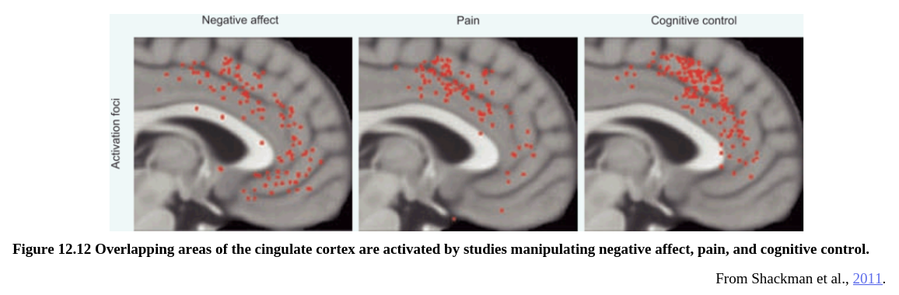

These findings should not be taken, however, to suggest a strict and rigid dichotomy between the functions of these cingulate zones, as other evidence suggests that cognition and emotion are not so entirely separable (e.g., Etkin et al., 2011; Pessoa and Pereira, 2013; Shackman et al., 2011). For example, a recent meta-analysis found that a particular region of the midcingulate cortex was activated by various manipulations of negative emotion, pain, and cognitive control (see Figure 12.12; Shackman et al., 2011), pointing to the cingulate’s role as an integrator of such information.

然而，这些发现不应被视为暗示这些扣带区功能之间的严格和严格的二分法，因为其他证据表明认知和情感不是完全可分离的。 例如，最近的一项元分析发现，中扣带皮质的一个特定区域被负性情绪，疼痛和认知控制的各种操作激活（见图12.12），指出扣带回的信息集成作用。

EEG studies of the [error-related negativity (ERN)](https://en.wikipedia.org/wiki/Error-related_negativity), which is generated by the cingulate cortex, also illustrate the complexity of teasing apart cognitive and emotional functions in the cingulate cortex. As discussed in Chapter 11, the ERN is an electrical response that occurs when a person detects that he or she has made an error, or when a person receives negative feedback about performance. Influential theories describe the ERN as part of a system of cognitive control, a signal that indicates when outcomes are worse than expected (Holroyd and Coles, 2002) or deviate from predictions (Alexander and Brown, 2011). Because an error is usually an unpleasant outcome, we could think of the error signal as an emotional signal. Indeed, errors, and particularly those that produce larger ERN responses, are associated with increases in the defensive startle reflex, an emotional response (Hajcak and Foti, 2008). In this sense, the fact that the ERN is generated by the cingulate cortex fits with the idea that the cingulate is involved in aspects of emotion. At the same time, an error signal also indicates the need for a change in attention or behavior, to avoid repeated mistakes.

由扣带皮层产生的与错误相关负电位（ERN）的脑电图研究也说明了在扣带皮层中梳理认知和情感功能的复杂性。如第11章所述，ERN是在当一个人发现他或她犯了错误，或者一个人收到有关自己表现的负面反馈时发生的一种电响应，有影响力的理论将ERN描述为认知控制系统的一部分，这一信号会发生在结果比预期更糟或偏离预测的时候。因为错误通常是令人不愉快的结果，我们可以将错误信号视为情绪信号。实际上，错误，特别是那些产生更大ERN反应的错误，与防御性惊恐反射的增加，这是一种情绪的响应。从这个意义上说，ERN是由扣带皮层产生的观点和扣带涉及情感方面的想法相合。同时，错误信号还表明需要改变注意力或者行为，以避免重复错误。

In the end, it may be useless to try to pigeonhole divisions of the cingulate, or phenomena produced by the cingulate such as the ERN, as either strictly cognitive or strictly emotional. Instead, it is more useful to consider possible relationships between emotional signals and cognitive control. For example, signals of emotional salience can cue the need for cognitive control (Inzlicht et al., 2015). Imagine you are driving down the road while not paying close attention, and start to accidentally drift toward an oncoming car. When you notice this looming danger, you will likely have a strong emotional reaction together with a redirection of your attention toward the task of driving as well as a motoric action of correcting your steering. Likewise, the sensation of pain, which activates the cingulate, is associated with a shift of attention toward the source of the pain and motivated efforts to take actions to relieve the pain. In these examples, signals of importance that are tagged by emotion (“there’s danger ahead!” or “there’s something that hurts!”) are communicated to systems that act to redirect attention and action.
最后，试图将扣带回的区域或者由扣带回产生的现象，诸如ERN，归类为严格认知意义上的或是严格情感意义上的想法没有什么意义。相反，考虑情绪信号和认知控制间的关系更有帮助。例如，情绪突显的信号可以找到认知控制的线索。想象你在开车的时候没有特别注意并且车子开始意外地飘向一辆要开过来的车子。当你发现这个在迫在眉睫的危险时，你可能会产生强烈的情绪反应，同时伴随着将你的注意力转向驾驶任务，以及纠正你的转向的动作。同样，激活了扣带的疼痛感是与将注意力转移到疼痛来源有关，并且激发缓解疼痛的努力。在这些例子中，通过情感标记的重要信号（“前方有危险！”或“有什么伤害！”）被传达给用于重新引导注意力和行动的系统。

The cingulate cortex clearly acts as a central hub linking emotion and cognitive control so that salient information can influence attention and action. At the same time, other cortical brain regions are important in additional functions that integrate cognition and emotion in different ways. These functions include the influence of emotion on decision making, the regulation of emotion, and the communication of emotion through facial and vocal cues. We discuss each of these functions in turn in the next few sections.

扣带皮层显然充当了情绪与认知控制的连接中心，使得明显的信息可以影响注意力和行动。 同时，其他皮质脑区域在以不同方式整合认知和情感的附加功能中起着重要的作用。这些功能包括情绪在决策中的影响，情绪调节，和通过面部和声音线索进行情感交流。我们将在下面几个章节中依次讨论这些功能。
