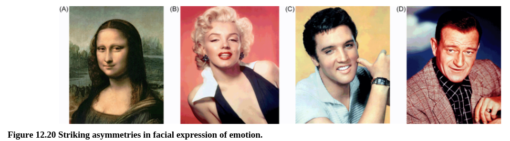
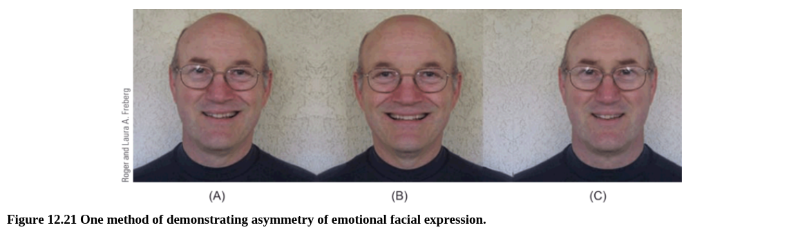
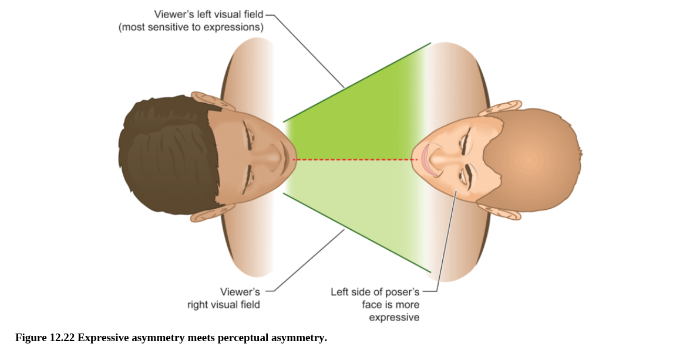

In another approach, typically used with neurologically intact individuals, the emotional expression appearing on the left side of the face is compared with that appearing on the right. Often, we can observe facial asymmetries merely by looking at a face, as shown in Figure 12.20. However, one way to quantitatively evaluate facial asymmetry is to cut a picture of a person’s face in half and to splice each half-face together with its mirror-image to create a composite. The result is two chimeras, one consisting of two left half-faces and the other of two right half-faces. When this is done, we can instantly see large differences in the appearance of the two sides of the face (see Figure 12.21). People typically rate left-face composites as more expressive than right-face composites (Sackeim et al., 1978). Moreover, high-speed videography approaches have quantified asymmetries in the initiation of facial expressions, finding that spontaneous expressions tend to start on the left side of the face, implying right-hemisphere dominance (Ross and Pulusu, 2013). Nonhuman primates, like macaque monkeys and chimpanzees, also exhibit more dramatic expressions on the left side of the face (Fernandez-Carriba et al., 2002; Hauser, 1993; Wallez and Vauclair, 2012).

在另一种方法中，通常令神经系统完整的个体，比较出现在左侧的面部情绪表情和右侧的面部情绪表情。通常，我们可以仅仅通过盯着脸看就能观察到面部的不对陈，如图12.20所示。然而，一种量化评估面部不对陈的方法是将一个人的脸的图片分成两半，之后将其中一半翻转后接合到这一半上。结果是有两个复合体，一个包括两个左脸，一个包括两个右脸。当这个完成的时候，我们可以直接看到两侧脸的不同。人们通常认为左脸复合比右脸复合更有表现力。更进一步，高速摄像方法已经证实在面部表情开始时左右脸的不对称，发现自主表达倾向于在左脸开始，意味着右半球起主控作用。非人灵长类，例如猕猴和大猩猩，也在左脸有更夸张的表情。

*Although we think of people’s faces as symmetrical, asymmetries can be seen. Note the asymmetrical expressions on some well-known faces: (A) the Mona Lisa, (B) Marilyn Monroe, (C) Elvis Presley, and (D) John Wayne.*

*An original photograph of the face, shown here in (A), is bisected. Then, each half-face is spliced together with its mirror-image to create a composite. Note the difference between the two composites depicted in (B) and (C). Which one looks more emotionally intense to you? Usually, individuals choose the composite composed of two left half-faces, depicted in (B), as more intense than the composite composed of two right half-faces, depicted in (C). This result suggests that the right hemisphere, which controls the lower left half of the face, has a larger role in producing facial emotional expression.*

If you’ve carefully followed our discussion of hemispheric differences in perception and expression of emotion in the face, you may have noticed an odd paradox. Remember that, because of right-hemisphere specialization for emotional expression and perception, emotion is most strongly expressed on the left side of a poser’s face (due to right-hemisphere specialization in the poser), and that people are best at understanding emotional expressions seen in the left visual field or left side of space (due to right-hemisphere specialization in the viewer). This means that for two people directly facing each other in a communication context, the most expressive side of the poser’s face will fall into the least sensitive half field of the viewer! (See Figure 12.22 if you are having some left–right confusion.) This doesn’t seem to be optimally adaptive for the purpose of communication.

如果你仔细读了我们关于在面部感知和情绪中半球的差异，你也许已经注意到了一个奇怪的悖论。请记住，因为右半球对面部表情和感知具有专业功能，情绪很大程度上一个在做面部表情的人左侧（由于做表情的人的右脑专业功能），人们擅长在左视野或者左侧空间出现的情绪表情（由于观察者右脑的专业功能）。这意味着在一个交流情境中两个人面对面时，做表情的人最能表现情绪的一侧展示给了观察者对情绪不敏感的一侧（见图12.2如果你对左右有困惑）这看起来并不最适合交流的目的。

*When two participants interact in face-to-face conversation, the more expressive left side of one person’s face is projected onto the less-sensitive right visual field of the other person. This illustrates the paradoxical outcome when both participants have right-hemisphere specialization for emotional expression and perception. However, people tend to adapt to this phenomenon in real life by turning the head to show more of the left side of the face.*

Interestingly, some research has shown that when people wish to communicate emotional information, they turn slightly to show more of the left side of the face. Analyses of portraits throughout history reflect a bias toward showing more of the left portion of the face, unless the portraits were made of scientists, who presumably put less emphasis on emotional expressivity (McManus and Humphrey, 1973; Nicholls et al., 1999). When participants are asked to pose for a photograph in which they are encouraged to show their emotions, they are more likely to show the left cheek than if asked to pose for an “impassive” photo (Nicholls et al., 1999). This turning bias in portraiture illustrates how cerebral asymmetries for emotion can subtly manifest themselves in everyday life.

有趣的是，一些研究显示当人们愿意交流情绪信息时，他们倾向于稍稍展示左侧更多的面部。对历史中肖像的分析反映了对于展示更多左侧脸的偏好，除非肖像是科学家的，他们更少强调情绪的表现性。当被试为拍照摆动作，他们被鼓励来展示他们的情绪时，他们更倾向于展示左脸颊相较于被要求摆出“没感觉的”照片的情形。这个在肖像中的转向偏好显示大脑对于情绪的不对称性可以在日常生活中稍稍展现自己。
