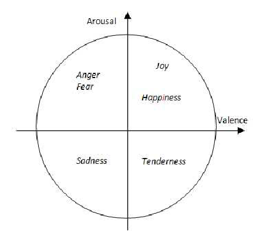

The **valence-arousal model of emotion** has been particularly helpful in differentiating the patterns of brain activity that characterize depression and anxiety (Heller et al., 2003). Although both depression and anxiety are certainly unpleasant rather than pleasant mood states, they differ in the arousal dimension. Depression is typically a low-arousal state, whereas anxiety is often a high-arousal state, and therefore they are likely to differentially involve the right hemisphere’s posterior regions. We consider the brain regions involved in anxiety and depression in more detail in Chapter 14.

情绪的正负性-唤醒度模型在区别描述抑郁和焦虑的大脑活动模式具有特殊的作用。虽然，抑郁与焦虑的确是不愉快而不是愉快情绪的状态，它们在唤起维度上不同。抑郁通常是低唤起状态，然而焦虑通常是高唤起状态，因此它们可能有区别地涉及右半球后部区域。我们会在14章中考虑涉及焦虑和抑郁的大脑区域。

While dimensional models of emotional experience have been successful in tying broad dimensions of emotional experience to fundamental brain systems, recent studies have taken an alternative approach that examines distributed activity across a wide range of brain regions during emotional states. Here, the idea is that different emotions may have “signatures” that are broadly distributed rather than tied to a single brain region or system. Studies taking this approach have used **multivariate pattern analysis** (see Chapter 3) in an attempt to identify patterns of brain activity that correspond with specific emotions (e.g., Kragel et al., 2016; Saarimäki et al., 2016; Touroutoglou et al., 2015). Although researchers still disagree about the best way to interpret results of these studies, the results generally indicate that different emotional states are associated with unique yet highly overlapping patterns of activation. That is, different emotional states can be distinguished statistically based on their distributed patterns of brain activation, but they also share regions in common as well. For example, many emotional states are associated with increased activity in a “salience network” that includes portions of the insula and anterior cingulate cortex (Touroutoglou et al., 2015).

情绪体验的维度模型已经成功地将许多情绪体验的维度变成大脑系统的基础，最近的研究采用了另一种方法用于检测情绪状态期间各种大脑区域的分布活动。这里的观点是不同情绪可以拥有广泛分布于大脑的“签字”相较于情绪只和某个固定的区域或系统联系。采用这种方式的研究已经采用多变量模式分析（见第3章），试图找出与特定情绪相对应的大脑活动模式。虽然研究者仍旧不同意解释这些研究结果的最好方法，结果通常显示不同的情绪状态与单一但高度重叠的激活模式相关。也就是说，不同的情绪状态可以依据它们脑激活的分布模式在统计上进行区分，但是它们也在共享同一个区域。例如，许多情绪状态与在“显著网络”中的活动增加有关，“显著网络”包括一部分脑岛和前扣带皮层。

When considering why brain activity associated with an emotional experience might be distributed across many sectors of the brain, it is helpful to remember that emotional experience does not exist in isolation from all of the other components of emotion that have been reviewed in this chapter. Rarely do we simply sit and feel an emotion. Rather, emotions are integrally associated with various changes in information processing and behavior. For example, imagine that you hear a loud clap of thunder while at the beach. You are likely to engage in a suite of cognitive and behavioral changes associated with a feeling of fear. You may activate the fight-or-flight response, mentally note your own racing heart rate, remember the last time you got caught in a thunderstorm, alter your visual attention toward the skies and your auditory attention toward possibly new rumbles of thunder, attempt to regulate your feelings (“maybe that thunder is distant”), alter your facial expressions and tone of voice (assuming a worried expression and perhaps yelling, “Kids! Time to get out of the ocean!”), and make decisions about whether to pack up and go home or wait it out. Ultimately, any comprehensive understanding of emotional experience must take into account how all these aspects of emotion are integrated within the brain.

当考虑为什么脑活动与可能分布于大脑各处的一种情绪体验相关时，有必要记住情绪体验并不存在于一个单独区别于在这章中涉及的其他情绪部分的区域。而是，情绪整合信息处理与行为的多种改变。例如，想象你在海滩的时候听到一声雷响。你很可能会参与一些与恐惧感觉有关的认知和行为变化。你可能激活战斗-或-逃跑反应，大脑注意到你自己不断加速的心跳，记住你在上一次暴风天袭击，将你的视觉注意力转向天空以及将你听觉的注意力转向雷雨可能的新隆隆声，尝试调节你的感受（“可能雷雨很远”），改变你的面部表情和说话声音（假设一个担忧的表情和可能的叫喊，“孩子们！是时候从海里出来了”），并且决定是否收拾行李回家或者等雷雨停止。最终，任何对于情绪体验的全面理解必须考虑所有这些方面的情绪是如何整合进大脑的。
