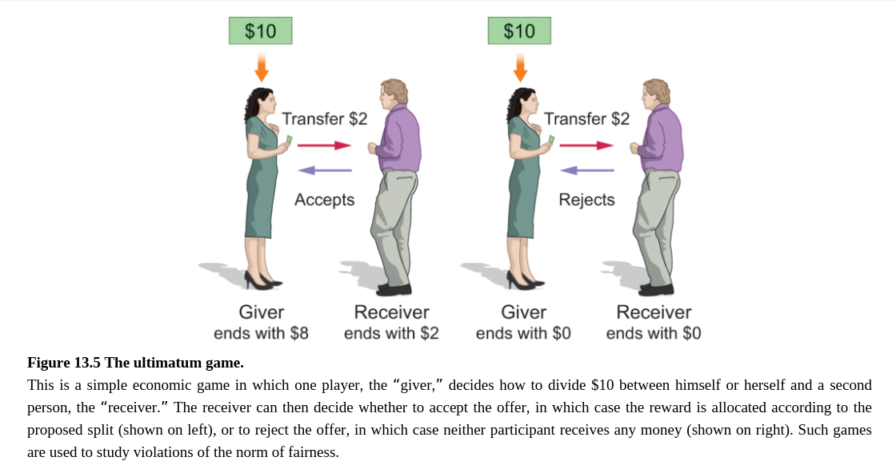
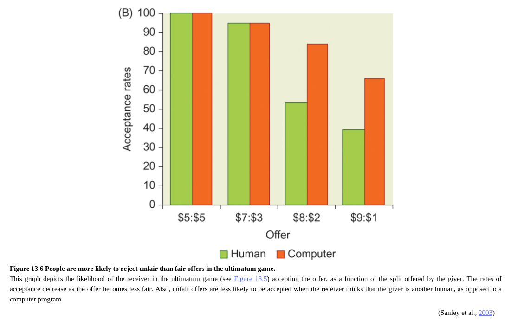

Neuroimaging studies of social norm compliance have tended to focus on certain economic games in which social norms of fairness are critical in the game. For example, several studies have made use of the “ultimatum game,” also known as the “take it or leave it” game. In this game, one player (the “giver”) decides how to split a reward (e.g., valuable points or money) between herself and another player, the “receiver” (Figure 13.5). The fair action is to divide the reward evenly between the players, and people generally expect that others will follow this fairness norm in sharing. Deviations from the fairness norm, in the form of an unfair split, are generally perceived as socially inappropriate. For example, imagine if you and your friend found a box of 10 delicious chocolates, and he gave you two and proceeded to eat the other eight himself.

关于社会规范顺从的神经影像学研究倾向于关注在博弈中社会公平规范起到重要作用的某些经济博弈。例如，几个研究采用了“最后通牒博弈”，也被称为“接受或拒绝”博弈。在这个博弈中，一个玩家（给予者）决定在她自己和另一个玩家接受者之间如何分一笔奖金（例如，价值点或者钱）(图13.5)。公平的方式是在玩家间平分这笔钱，之后人们通常期待其他人将会跟随这个分配的公平规范。偏离公平规范，以不平分的方式分这笔钱，通常被认为是社会不恰当的行为。例如，想象你和你的朋友发现了一盒有10条美味巧克力的合资，他给了你两条然后自己去吃了另外八条。

Economic games like the ultimatum game provide a useful way to study norm compliance because deviations from the norm can be quantified. For example, a 90:10 split of resources is more deviant from the fairness norm than is a 60:40 split. In addition, researchers can examine how the behavior of others is affected by violation of the fairness norm, because the games typically allow some form of retribution. Specifically, in most versions of the game, the player receiving the offer can decide to take it, in which case the reward is allocated according to the proposed split, or leave it, in which case neither player gets anything. Generally, people are more likely to reject an offer the more it deviates from a fair split (Figure 13.6). In this way, the consequences of violating social norms can be examined in ways that are more concrete than in many real-life social interactions.

类似于最后通牒博弈的经济博弈提供了一种研究社会规范顺从的一种有效方法，因为偏离规范可以被量化。例如，一个90：10的资源分割是比60：40的资源分割更加偏离公平规范。此外，研究者检查了其他人的行为是如何被公平规范的破坏影响的，因为博弈通常允许某些形式的惩罚。具体来说，在博弈中的大多数版本中，玩家得到一个分配提议可以决定是接受，在这种情况下，奖励是依据提议分配，或者拒绝提议，这种情况下两者什么都不能得到。通常情况下，人们更可能拒绝一个离公平分配更远的提议（图13.6）。在这种方式下，违反社会规范的结果可以通过比许多现实生活中的社会互动更具体的方式来检验。

Neuroimaging studies of the ultimatum game (and related economic games) have revealed a few key findings. First, consistent with the unpleasantness of being treated unfairly, activity in the anterior insula of the receiver increases with increasing levels of unfairness of an offer (Sanfey et al., 2003; see also Chen et al., 2015). This could be expected given the role of the insula in registering disgust (see Chapter 12). Interestingly, the insula’s response to an unfair offer from another person was greater than to that same unfair offer when the receiver thought it was coming from a computer (Sanfey et al., 2003). This underscores the interpersonal element of the fairness norm and its perceived violation. Moreover, the same study found that activity in anterior cingulate and dorsolateral prefrontal cortex also increased in the recipients when they received an unfair offer, compared to a fair offer. These increases could be due to the greater demands on cognitive control when making a decision about whether to reject an unfair offer.

关于最后通牒博弈的神经影像学研究（以及相关的经济博弈）显示了一些关键的发现。首先，与被不公平对待的不高兴的感觉一致，接受者前脑岛的的活动随着提议不公的水平增加。考虑到脑岛在厌恶中的作用，可以预料到这一点。更进一步，相同的研究发现当收到不公平的提议时，接受者的前扣带和背外侧前额皮质的活动增加，相较于公平提议的情况。这些增加可能是由于当决定是否拒绝一个不公平的提议时需要更强的认知控制。
