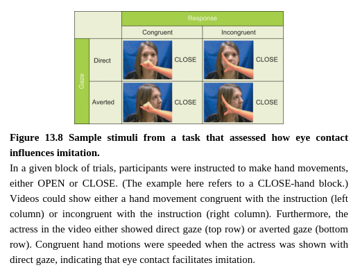

Mirror neurons seem like a plausible candidate for supporting imitation. Indeed, neuroimaging studies in humans have found that imitation of simple finger movements resulted in increased activity in inferior frontal cortex, the region where mirror neurons are found in monkeys (Iacoboni et al., 1999; see also Kilner et al., 2009). Moreover, disrupting activity in inferior frontal cortex using TMS decreases the ability to imitate finger movements (Heiser et al., 2003). Complementing this finding, another study found that stimulating the inferior frontal cortex with tDCS increased the degree of motor mimicry in social interaction, whereas sham stimulation or stimulation to the temporoparietal junction (another region involved in social processing, see below) did not (Hogeveen et al., 2015). Taken together, these studies support the idea that inferior frontal cortex plays an important role in motor mimicry.
镜像神经元看起来是支持模仿的潜在候选者。实际上，关于人类的神经影像学研究已经发现简单手指运动的模仿导致了下额叶区域活动的增加，这个区域是在猴子身上发现的镜像神经元。更进一步，在使用TMS对下额叶的干扰活动降低了模仿手指运动的能力。对于这个发现的补充，另一些研究发现用tDCS的刺激下额叶增加了在社会互动中的进行运动模仿的程度，同时伪刺激或者对于颞顶连接处的刺激（另一个区域涉及社交处理，见下）却没有。将这些综合起来，这些研究支持了下额叶在镜像模仿中起着重要的作用。

When mimicry happens in real life, it usually happens in a complex social situation with many social cues present. For example, imagine that you are at a job interview, and the interviewer clasps her hands together in her lap. Are you likely to mimic the same posture? It may depend on whether other social cues, such as the interviewer’s tone of voice, facial expression, handshake, and language, establish a sense of rapport. Though untangling the interaction among all of these cues is challenging, researchers have begun to address how mimicry is related to one very important social cue, eye contact.

当模仿在现实生活中发生时，它通常在有许多社会线索的复杂社交状况下发生。例如，想象你在面试，面试官在她的腿上紧握双手。你有可能会模仿相同的姿势吗？它可能依据是否其他的社会线索，例如面试官声音音调，面部表情，握手和语言，建立一种和睦的感觉。虽然解开这些线索的关系是具有挑战的，研究者已经开始处理模仿是如何与一种非常重要的社会线索——对视是如何联系起来的。

Initial behavioral research indicated that establishing eye contact enhances the tendency to mimic another person (Wang, Newport, and Hamilton, 2011). The study made use of a paradigm in which participants were instructed, for a given set of trials, to make either open-hand or close-hand movements for that set of trials. On each trial within the set, an image of a person’s hand was presented either opening or closing. On [**congruent trials**](https://www.researchgate.net/figure/The-three-trial-types-congruent-neutral-and-incongruent-in-the-Simon-task_fig2_288480722), the hand movement in the video was the same as the instruction to the participant for the set (e.g., video of an opening hand during an open-hand set), and on incongruent trials, the depicted movement was different than the instructed movement (e.g., video of an opening hand during a close-hand set of trials). Imitation is indexed by the extent to which the participant’s own hand movement is influenced by the other person’s hand movement. In the behavioral study, participants showed a greater degree of imitation when they viewed an actress making direct eye contact before moving her hand, as opposed to when the actress was shown with an averted gaze (see Figure 13.8).

最初的行为研究表明确立对视加强了对于另一个人模仿的倾向。研究采用一种范式，其中被试收到指示，对于一组测试的实验，对那组测试做一个开手或握拳的动作。在每组测试的每个测试，一个人开手或握拳的图被展现出来。在同侧测试中，在视频中手的活动与该组参与者收到的指示相同（例如，在开手组的开手视频）。模仿是通过被试参与者自己手的活动受到其他人手活动的程度。在行为研究中，被试显示了更大程度手的活动当他们看到一个演员在移动手前进行直接的目光接触，相较于演员采用避开目光的情况。

