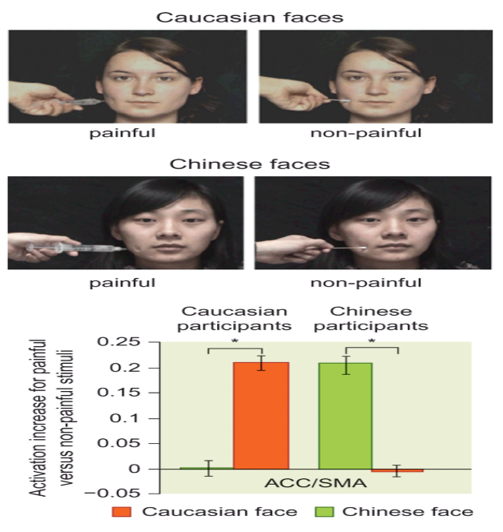

Not surprisingly, evidence suggests that we show greater empathic neural responses to those whom we perceive to be within our own social group. In a somewhat humorous example, fans of the rival Yankees and Red Sox baseball teams watched videos of baseball plays that favored either their team or the rival team (Cikara et al., 2011). Yankees fans showed elevated activity in a caudal region of the anterior cingulate and in the insula (regions also activated by pain and disgust) when the Yankee players performed poorly or when their rival Red Sox players performed well, and they showed elevated activity in the reward-related ventral striatum when the Yankee players performed well or Red Sox players performed poorly. Needless to say, the Red Sox fans showed the opposite pattern.

毫不意外，证据表明我们展示了对于那些我们认为在我们自身的社会群体中很大的移情神经反应。在一个某种程度上诙谐的例子中，洋基队的粉丝和红袜队观看了棒球比赛的视频他们喜欢队伍的比赛或者他们敌对队伍的比赛。洋基队粉丝显示了在前扣带尾部区域以及脑岛（该区域也被痛苦和恶心激活）上升的活动，当洋基队表现很差或者当他们敌对的红袜队表现好时，并且他们展示了与奖励有关的腹侧纹状体上升的活动，当洋基队表现好或者红袜队友表现差时。不用说，红袜粉丝展示了相反的模式。

In more sobering results, other studies have found that empathic responses are more pronounced when we view people of our own racial group in distress, compared to people of other racial groups. For example, one study showed pictures of painful (needle) and nonpainful (Q-tip) stimulation of both Caucasian and Chinese faces to both Caucasian and Chinese participants (see Figure 13.17; Xu et al., 2009). Caucasian participants showed greater activation of the anterior cingulate in response to painful stimulation of Caucasian compared to Chinese faces, and Chinese participants showed the opposite pattern. Other studies have found that the degree of insula activation in response to seeing an in-group member’s pain can predict greater helping behavior (Hein et al., 2010). Such findings of greater in-group empathic responses lead us to consider not only the existence of social categories, but also how such categorization may lead toward biased behavior.

在更清晰的结果中，其他研究发现移情响应在当我们在痛苦中看待我们种族群体的人们相较于其他种族群体的人们更有力。例如，一个研究显示高加索人和中国人都面对高加索人和中国人的痛苦的（针）和不痛苦的（Q-tip）刺激的照片（图13.17）。高加索被试展示显示了在观看高加索人痛苦针刺照片相较于看中国人面孔时，前扣带活动更强烈的反应，中国被试显示了相反的反应。其他研究发现在看到组内成员的疼痛时，脑岛激活的程度可以预测更强的帮助行为。这些更强的组内移情响应导致我们考虑不仅仅是社会分类的存在，也考虑这种分类可能导致有偏差的行为

Figure 13.17 The brain’s response to another person’s pain depends on the person’s social category.
Chinese and Caucasian participants viewed pictures (top row) of Caucasian and Chinese faces receiving either painful or nonpainful stimulation. Participants showed enhanced activity in the anterior cingulate/supplementary motor area (ACC/SMA) for painful versus nonpainful stimulation only when the face matched the participant’s own social category.
图13。17大脑以来人们的社会类型而对于另一个人痛苦的反应。
中国和高加索被试观看高加索和中国人受到痛苦与不痛苦刺激的面孔图片（第一行）。被试显示了在前扣带和辅助运动区的增强反应仅仅在面孔与被试自身社会分类相符时产生反应。

## Stereotyping and Prejudice

The formation of social groups can be innocuous in some circumstances, but it can also lead to biased behavior in various forms. Biases in beliefs, attitudes, and behaviors are often discussed with reference to the concepts of stereotyping, prejudice, and discrimination. Traditionally, stereotyping refers to the tendency to assume that certain characteristics are universally true of group members. For example, we may hold a stereotype that women are nurturing or that Asians are good at math, meaning that we assume something about individuals within these groups simply based on group membership. We are more likely to hold stereotypes about groups to which we do not belong. Prejudice, in turn, refers to a negative attitude about a particular social group. For example, imagine someone who expresses a general dislike for immigrants; he would be called prejudiced. Discrimination, finally, refers to behavior that is biased against a particular social group. For example, consider a company CEO who pays black workers less than white workers, or a restaurant manager who refuses to serve people with disabilities. Stereotyping, prejudice, and discrimination all involve biases about social groups, but they are distinguishable in the degree to which they are centrally cognitive, affective, or behavioral manifestations of bias.

在某些情况下，社会群体的形成可能是无害的，但也可能导致各种形式的偏见行为。信仰，态度和行为的偏见经常参照陈规定型观念，偏见和歧视的概念进行讨论。传统上，刻板印象是指假设某些特征在群体成员中普遍存在的倾向。例如，我们可能持有女性负责养育小孩的刻板印象或亚洲人擅长数学的刻板印象，这意味着我们仅仅根据群体成员资格对这些群体中的个人进行假设。我们更有可能对我们不属于的群体抱有刻板印象。反过来，偏见是指对特定社会群体的消极态度。例如，想象一个表达对移民普遍不喜欢的人;他会被称为怀有偏见。最后，歧视指的是对特定社会群体有偏见的行为。例如，考虑一个公司的首席执行官，他支付的黑人工人比白人工人少，或者是一个拒绝为残疾人服务的餐馆经理。刻板印象，偏见和歧视都涉及社会群体的偏见，但他们在偏见主要是认知方面，情感方面还是行为表现方面的程度上是可区分的。
