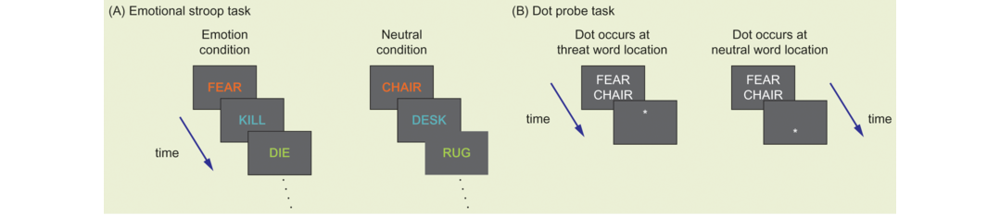

Anxious apprehension and anxious arousal occur in different mixes in the various anxiety disorders. For example, in generalized anxiety disorder, worry dominates. During panic attacks, anxious arousal dominates; however, a person with panic disorder often develops worries about a potential panic attack. Likewise, someone with a phobia about public speaking may worry in advance about an upcoming class presentation, and he or she may experience anxious arousal (panic) at the time of the presentation. As we will see later, anxious apprehension and arousal appear to have different neural correlates.

焦虑忧虑和焦虑唤醒在多种焦虑症状中混合。例如，在广谱焦虑症状中，担忧占据主导。在惊恐发作期间，焦虑唤醒主导；然而，患有惊恐障碍的人通常发展出对于潜在惊恐的担忧。同样地，对于公开演讲有惊恐症的人可能提前担心即将带来的课堂展示，并且他或她可能在展示时经历焦虑唤醒（惊恐）。正如我们之后看到的，焦虑忧虑和唤醒似乎具有不同的神经相关性。

Cognitively, the main feature of anxiety disorders is an exaggerated bias to pay attention to threatening information in the world (Armstrong and Olatunji, 2012; Cisler and Koster, 2010). This attentional bias has been demonstrated through various cognitive tasks. In the emotional Stroop task, the person must identify the ink color of words. Anxious individuals are slower to name the ink color of emotionally threatening words, such as “kill,” than nonemotional words such as “sum,” implying that attention has been automatically captured by the word’s emotional meaning (see Figure 14.13A).

从认知角度看，焦虑症的主要特点是夸张地关注现实世界中威胁信息。这个注意力偏误已经通过多种认知任务显现。在情绪Stroop任务中，人们必须确认单词的墨水颜色。焦虑个体更慢地命名情绪上具有威胁的词汇，例如“杀”，相较于非情绪的词汇，例如“求和”，意味着注意力自动地被词汇地情绪含义吸引（见图14.13A）。

Figure 14.13 Cognitive tasks used to measure attentional biases in anxiety.

(A) Emotional Stroop task: The participant must identify the ink color while ignoring the word meaning. Anxious people are slower when the word is emotionally threatening (e.g., “fear”) than when it is neutral (e.g., “chair”). (B) Dot probe task: The participant must press a button as quickly as possible when a dot appears somewhere on the screen. The dot is preceded by two words, one threatening and one neutral. These words are irrelevant to the main task. However, anxious people will tend to respond more quickly to the dot when it appears at the same location where a threatening word had just been shown than when it appears at the location where the neutral word was shown, indicating that attention has been shifted to that threatening word.

Another task used to demonstrate attentional bias toward threatening information is the **dot probe task**. In this task, the person simply has to indicate the presence of a dot that is flashed on the screen. The dot is preceded by a pair of words, one of which is emotionally threatening. Researchers compare the speed of response to the dot depending on whether it appears at the same or opposite location in relation to the threatening word (see Figure 14.13B). Participants who shift attention toward the emotional word will be faster to respond to the dot when it appears at that location. In these tasks and in others that are similar, anxious people tend to show an increased attentional focus on threatening information, especially if the information is associated with the specific object of their anxiety (e.g., the word “web” for people who have a phobia of spiders). Training to reduce attentional biases can help to reduce anxiety symptoms (Hakamata et al., 2010), and individual differences in the degree of attentional bias can predict treatment outcome (Barry et al., 2015).

另一个展示对于威胁信息注意偏误的任务是点探测任务。在这个任务中，人们简单地指示一个屏幕上快速移动的点。点出现在一对单词前，其中一个是具有情绪威胁的。研究者比较了响应的速度，依据点是出现在具有威胁单词的相同位置还是不同位置。在这些任务和其他相似任务中，焦虑的人倾向于显示对于威胁信息增加的关注，特别是如果信息是与他们焦虑相关的某个具体东西（例如，“网”对于那些具有蜘蛛惊恐症的人）。训练降低注意偏误可以帮助减轻焦虑症状，并且注意力某种程度的个体差异可以预测治疗结果。

