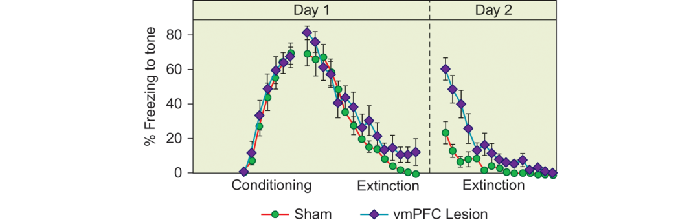

In the previous section, we discussed the role of the amygdala in [**fear extinction**](https://www.nature.com/articles/4001939). However, the amygdala is not solely responsible for this process; regions of the medial prefrontal cortex contribute to extinction as well. Animal studies show that lesions in the medial prefrontal cortex can lead to an impairment in extinction, particularly in the ability to retain learned extinctions – the knowledge that a cue now signals a “safe” situation (Milad et al., 2006; Sotres-Bayon et al., 2004; see Calhoon and Tye, 2015, for review). Figure 14.15 illustrates sample results from extinction learning in an animal study. A recent study in humans with surgical damage to the ventromedial prefrontal cortex found elevated amygdala responses to negative information, fitting with the animal studies in implying that medial prefrontal cortex normally regulates the amygdala’s [reactivity](https://www.thefreedictionary.com/reactivity) (Motzkin et al., 2015). Reduced activation of the ventromedial prefrontal cortex in anxious people, such as patients with PTSD (Pitman et al., 2012), may lead to difficulty in remembering that feared situations are actually safe.

在之前部分，我们考虑了杏仁核在消除恐惧中的作用。然而，杏仁核不仅仅是负责这个过程；内侧前额皮质也有助于恐惧消退。动物研究表明在内侧前额皮质的损伤可能导致消退功能的损伤，特别是保持已经学到的消退能力-即知道一个线索现在传达了“安全”信号。图14.15展示了在动物研究中消退学习的样本结果。一个最近关于腹内侧前额皮质手术损伤的人类研究发现对负面信息上升响应的杏仁核，这符合动物研究中，内侧前额皮质通常调节杏仁核的重激活。在焦虑人群中降低的腹内侧前额皮质，例如有PTSD的病人，可能导致很难记住恐惧情况实际上的是安全的。

Figure 14.15 Effects of medial prefrontal lesions on extinction learning.

During the conditioning phase, the rat learns to associate a tone with a shock; freezing behavior to the tone (shown on the y axis) increases equally for sham-lesioned animals and those who received a lesion to the medial ventromedial prefrontal cortex (vmPFC) prior to conditioning. During the extinction phase, the tone is presented alone without the shock. As the number of trials without shock increases, freezing behavior to the tone decreases, slightly more for sham-lesioned than vmPFC-lesioned animals. More dramatically, however, rats with vmPFC lesions do not retain extinction learning from the first to the second day of testing to the same extent as sham-lesioned rats, and extinction must be relearned.
Source: Fig. 2 in Milad, M. R. et al. (2006). Fear extinction in rats: Implications for human brain imaging and anxiety disorders. Biological Psychology, 73, 61–71. Reprinted by permission of Elsevier.

Prefrontal–amygdala interactions may also contribute to the threat-related attentional bias that is characteristic of anxious people (Bishop, 2007). One study provided evidence that frontal lobe regions may not exert as much top-down control in anxious individuals when distracting threatening information is present (Bishop et al., 2004a). In this study, as threatening distractors became more frequent, activity in dorsolateral frontal regions tended to increase, presumably as part of a system of cognitive control. However, this effect was reduced in people who reported high levels of anxiety. Highly anxious participants also had reduced activity in the rostral anterior cingulate cortex in this study. Together, the results suggest possible dysregulation of frontal lobe control systems in anxious people. Although the implications for treatment are not yet clear, one possibility is that cognitive training in controlling the focus of attention could benefit anxious people.

前额-杏仁核交互作用有可能导致与威胁相关的注意偏差，这种偏差是焦虑人群的特点。一项研究提供的证据显示当威胁信息展现时，前额叶区域可能在焦虑人群中没有是施展许多自上而下的控制。在这项研究中，随着威胁分散因素变得更加频繁，背外侧前额区域的活动倾向于增加，可能该区域是认知控制系统的一部分。然而，这个效应在报告更高焦虑症状的人中减少。在该研究中，高度焦虑的参与者也在喙侧前扣带皮质具有减少的活动。总之，结果表明焦虑人群中前额叶控制系统可能出现丧失调控能力。虽然对于治疗的影响还不清楚，一个可能是控制注意力焦点的认知控制可以使焦虑的人受益。

## Monitoring and the Anterior Cingulate

Ventral portions of the anterior cingulate cortex have also been implicated in a number of different anxiety disorders, most likely due the role of this region in action monitoring (Koban and Pourtois, 2014). As we’ve learned previously, activity in the anterior cingulate can serve to select actions and to send an important signal to other brain systems, indicating whether an action has led to a desired outcome (see Chapter 11).

前扣带皮质的腹侧部分也涉及一系列不同的焦虑障碍，大多数可能是由于该区域在行动监控中的作用。正如我们之前学过的东西那样，在前扣带的活动可以作为选择行动和传递一个重要信号到其他大脑系统，指示一个行动是否已经导致了一个想要达成的结果（见11章）。

As such, it may not surprise you, then, to learn that studies have found heightened activity in the anterior cingulate cortex among anxious people. For example, the error-related negativity, which represents activity in the cingulate cortex following errors, is elevated in patients with obsessive-compulsive disorder and in those who report high levels of worry (Gehring et al., 2000; Hajcak et al., 2003; Moser et al., 2013). Neuroimaging studies have also found that the cingulate’s activity is higher in people with anxiety disorders compared to control participants, both during resting conditions and when provoked by threatening stimuli (Kent and Rauch, 2009). An overactive anterior cingulate region may reflect that the values of actions are given a heightened affective tag.

因此，你也许不会惊讶地了解到研究已经发现焦虑人群中地前扣带皮质增加了。例如，错误相关负性（其代表错误后扣带皮质的活动）在有强迫障碍以及报告高水平担忧的个体的病人中活动升高。神经影像学研究也已经发现具有焦虑障碍人群相较于控制组被试具有更高的扣带活动，无论是在精细状态和威胁刺激产生的时候。一个过高前扣带区域可能反映了行动的价值被赋予了更高的情感标记。
