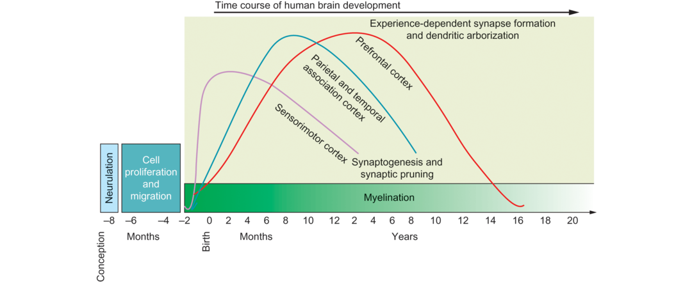
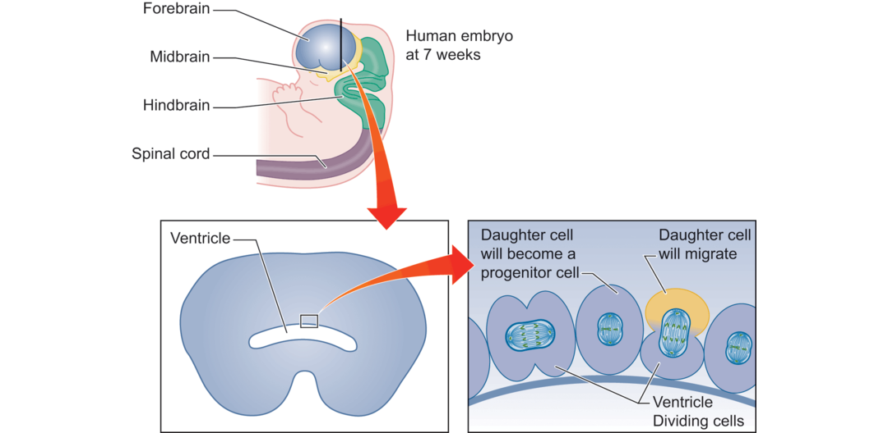
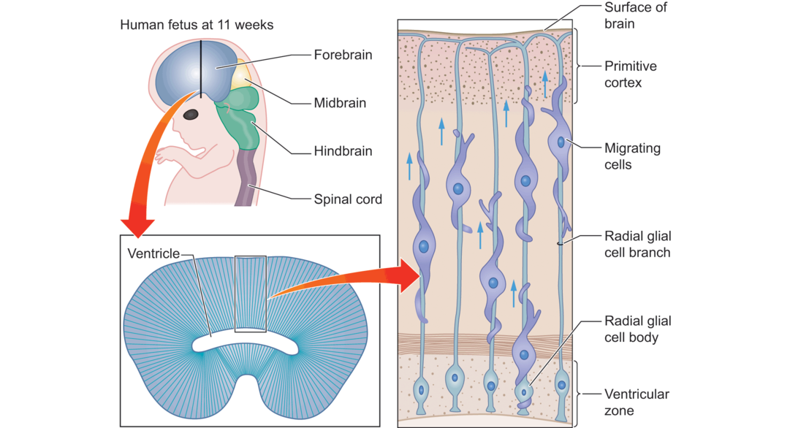

# Development of the Brain

The brain changes in numerous ways from the beginning of life to adulthood. As you can imagine, an infant’s brain does not look exactly like an adult’s brain! You might think that the brain simply grows bigger as the child grows bigger, but the story is actually quite a bit more complex. While some aspects of neural development can be thought of simply as “growth” or proliferation, other aspects involve a more complex sculpting of nerve cells, their pattern of connections, and their organization. At all stages of development, from childhood through adolescence and adulthood, the challenge for researchers is not only to document how the brain changes, but also to understand how physical changes in the brain relate to developing cognitive and emotional skills.

从出生到成年，大脑以多种方式改变。正如你想象的那样，婴儿的大脑不完全像成人的大脑！你可能认为大脑简单地随着儿童成长而成长，但是故事实际上是更加复杂一点。虽然神经发育的一些方面可以被认为是“增长”或者增殖，其他方面涉及个更复杂的神经细胞形状，它们连接的模式，和它们的组织方式。在所有发育的阶段，从童年到青春期到成年，研究人员面临的挑战不仅仅是记录大脑是如何变化的，还要理解与大脑中相关认知与情绪能力的生理变化。

## Changes in the Brain During Childhood

Figure 15.1 gives an overview of the time course of major events during neural development. You can immediately notice several things from this figure. First, many processes take place during development, including cell proliferation and migration, development of synapses, and myelination. Second, each of these processes has its own time course; some processes take place primarily before birth, whereas others continue throughout adolescence. Finally, development cannot be thought of simply as a linear progression of growth. As you can see from the figure, processes such as the generation of synapses show an inverted-U function, rising and then falling, indicating initial increases and proliferation followed by subsequent reduction, pruning, or sculpting.

图15.1给出了神经发育过程中主要事件的时间进程的概览。你可以从图中立即注意到这些事情。首先，许多过程在发育过程中发生，包括细胞增殖和迁移，突出发育，以及髓鞘形成。第二，这些过程的每一步有它本身的时间进程；一些过程主要在出生前发生，而其他过程贯穿于整个青春期。最后，发育不能简单认为是一个发育的线性过程。正如你从图中看到的，例如突出生成的过程展示了一个倒U型函数，上升之后下降，表明初始的增加和增殖在潜在降低，修剪或塑形。

Figure 15.1 Overview of the time frame of human brain development.

图15.1 人类大脑发育的时间框架

Shown here is the time course of different processes involved in brain development, from conception through young adulthood.

这里展示的是涉及大脑发育的不同时间进程，从怀孕到青年时期。

Source: Figure 1 from Casey, B. J. et al. (2005). Imaging the developing brain: What have we learned about cognitive development? Trends in Cognitive Sciences, 9, 104–110. Reprinted by permission of Elsevier.

To understand brain development, let us start at the beginning (for review, see Silbereis et al., 2016). Early in fetal development, after the simple primordial fertilized egg differentiates into specific types of tissue (e.g., muscle, skeletal, cardiovascular, nerve), the spinal cord and brain are nothing more than a hollow tube. The formation of this tube is referred to as **neurulation**. With time, the tube folds, twists, turns, and expands to become the fetal brain, while the hole inside the tube becomes the ventricular system.

为了理解大脑发育，让我们首先从产生开始。在胎儿发育早期，在简单的原始受精卵分化为某个具体类型的组织，脊柱和大脑仅仅是个中空的管子。这个管子的形成被认为是神经胚形成。随着时间的推移，管子折叠，扭曲，转动，并且扩展成为胎儿的大脑，同时管子里的洞变成了脑室系统。

Around the seventh week of gestation, the nerve cells and glia near the inside of the tube divide, proliferate, and then begin to migrate outward. Neurogenesis, or the generation of new nerve cells, occurs in the area right around the ventricle (see Figure 15.2). In this process, the tube acts much like a port around which the initial neural settlers will reside. As more neurons are generated, the central areas around the ventricle become settled, and then the new neurons, like new immigrants to a city, must traverse further out to find a place to live. As the brain grows, new neurons travel further and further out to the metaphorical suburbs of the brain. Glial cells provide the scaffolding or “roads” along which nerve cells can migrate to their ultimate destinations (Figure 15.3). Thus, the six layers of cortex are built from the inside out; the first set of cells migrates to the deepest (innermost) layer of the cortex (the sixth), the next set of cells to the fifth cortical layer, and so forth.

大约妊娠期第七周，在管子内部的神经细胞和胶质分化，增殖并且开始向外迁移。神经发生或者新神经细胞的产生，恰恰发生在脑室周围（见图15.2）。在这个过程中，管子像是一个初始神经元的定居者会住在里面的港口。随着更多的神经元产生，脑室周围的中心区域变得固定下来，并且之后新的神经元，像到一个城市的新移民，必须向外来寻找一个居住的地方。随着大脑变大，新的神经元旅行的越来越远到达大脑所谓的郊区。胶质细胞提供了支架或者“道路”，神经细胞可以沿着这些到与迁移到最终的目的地（图15.3）。因此，皮质的六层从里到外建立；第一组细胞见一到皮质的最深层（第六层），下一组细胞到皮质的第五曾，以此类推。

Figure 15.2 Neurogenesis.

The creation of new nerve cells in embryonic development occurs in the ventricular zone. Progenitor cells that line the ventricles can divide, producing new daughter cells. The daughter cells can either stay in the ventricular zone and act as new progenitor cells, or they can migrate away from this zone and into other areas of the brain.

在胚胎发育中新神经细胞的建立发生在心血管区域。排列在脑室中的祖细胞可以分裂，产生新的子细胞。子细胞要么在脑室区充当新的祖细胞，或者他们从这个区域离开到达大脑中其他区域。

Figure 15.3 Migration of nerve cells.

Cells that migrate away from the ventricular zone often travel along radial glia, which form a kind of scaffolding along which the cells can migrate.

细胞经常沿着放射状胶质细胞从脑室区迁徙走，这形成了一种支架，细胞可以沿着它迁移。

By six months of gestation, most neurons have been produced. Because the development of the cortex is protracted during gestation, there is ample opportunity for disruption of the typical pattern. We will discuss syndromes involving disrupted development later in this chapter, including dyslexia and [fetal alcohol syndrome](https://www.mayoclinic.org/diseases-conditions/fetal-alcohol-syndrome/symptoms-causes/syc-20352901).

通过六个月的妊娠，大多数神经元已经被产生了。因为皮质的发育是在妊娠期是旷日持久的，所以有大量的机会破环典型的大脑模式。我们将会在本章后面讨论涉及破坏性发育的综合征，包括语言障碍和胎儿乙醇综合征。

