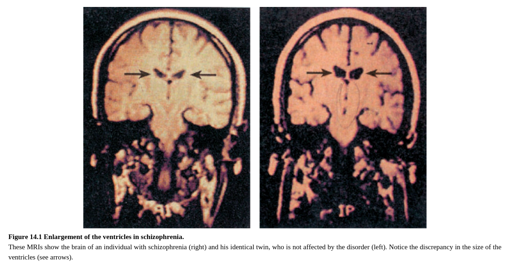
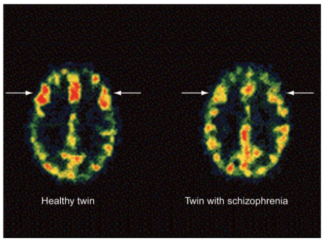

One of the first-noted and most reliable pieces of evidence of neural dysfunction in schizophrenia is enlargement of the lateral and third ventricles (Shenton et al., 2001). Ventricular enlargement, depicted in Figure 14.1, results from atrophy of brain tissue across many regions of the brain (e.g., Haijma et al., 2013). As such, it is a general indicator of tissue loss rather than an indicator of abnormalities in specific brain regions. The brain may continue to atrophy for up to 20 years after the person is first diagnosed, leading some to suggest that schizophrenia may be associated with a continuous pathophysiological process (Pol and Kahn, 2008). Furthermore, longitudinal research has found that decreases in brain volume are correlated with the duration of relapses over a seven-year follow-up period, suggesting that preventing relapses may be one way to alter the deteriorating path of brain atrophy (Andreasen et al., 2013).

精神分裂症中的神经功能障碍首先注意到和最可信的证据之一是侧脑室和第三脑室的扩大。如图14.1所示，脑室扩大是由于许多区域脑组织萎缩引起的。因此，它是组织损失的一般指标而不是某个特定脑区异常的指示。在一个人被诊断后大脑可能继续萎缩长达20年，这使得一些人认为精神分裂症可能与连续的病理生理过程有关。更进一步，纵向研究已经发现大脑容量的减少在7年的随访期中与复发的持续时间相关，表明防范复发可能是改变大脑萎缩恶化路径的一种方法。

Figure 14.1 Enlargement of the ventricles in schizophrenia.

These MRIs show the brain of an individual with schizophrenia (right) and his identical twin, who is not affected by the disorder (left). Notice the discrepancy in the size of the ventricles (see arrows).

To pinpoint more specific brain regions that may be implicated in schizophrenia, researchers have taken two main approaches. The first involves comparing cognitive deficits in schizophrenia to deficits in patients with known brain damage. A second approach is to use neuroimaging and other measurements of brain functioning to identify areas of difference in brain anatomy and function between schizophrenics and control groups. Both of these approaches have pointed to the frontal and temporal lobes as especially involved in schizophrenia.

为了确定可能与精神分裂症有关的更具体的大脑区域，研究人员采取了两种主要方法。第一种涉及比较精神分裂症患者的认知缺陷与已知脑损伤病人的缺陷。第二种方法是使用神经影像学和其他脑功能的测量方法来确定精神分裂症与控制组中大脑中解剖与功能上的不同的区域。这些方法都指向了额叶与颞叶在精神分裂症中的特别参与。

### Frontal Lobe

There are many indications that the functioning of the frontal lobes is compromised in schizophrenia. Many of the cognitive functions that are most disrupted in schizophrenia are dependent upon the frontal lobe, including working memory, self-monitoring, attention, cognitive control, and behavioral flexibility (Barch and Ceasar, 2012; Orellana and Slachevsky, 2013). For example, schizophrenic patients are impaired on tests of planning and tests of mental flexibility, such as the Wisconsin Card Sorting Test (see Chapter 11 for a description of this task). Not surprisingly, dozens of functional imaging studies have demonstrated hypoactivation (reduced activation) of frontal regions in individuals with schizophrenia compared to controls (see Figure 14.2). Hypofrontality (frontal hypoactivation) is evident in schizophrenia both when the person is quietly resting and when he or she is engaged in tasks that normally activate the frontal lobe.

有许多迹象表明额叶的功能在精神分裂症中受到损伤。许多精神分裂症中的被破坏最多的认知功能是依赖于额叶的，包括工作记忆，自我监控，注意力，认知控制和行为弹性。例如，精神分裂症患者在计划性测试与灵活性测试中表现不佳，例如维斯康辛卡片分类测试（见11章）。毫不奇怪的是，诸多功能影像研究表明与控制组相比，精神分裂症患者的额叶有低激活化（激活减少）（图14.2）。当人静静地休息和当他或她参与到通常激活额叶的任务中，精神分裂症患者的前向性（额叶低激活化）是显著的。

Figure 14.2 Hypofrontality in schizophrenia.

Areas of the frontal lobe (white arrows) show reduced activity in patients with schizophrenia compared with control participants, such as an identical twin who does not have the disorder. Areas with the most activity are shown in red, followed by regions shown in orange, and yellow.

