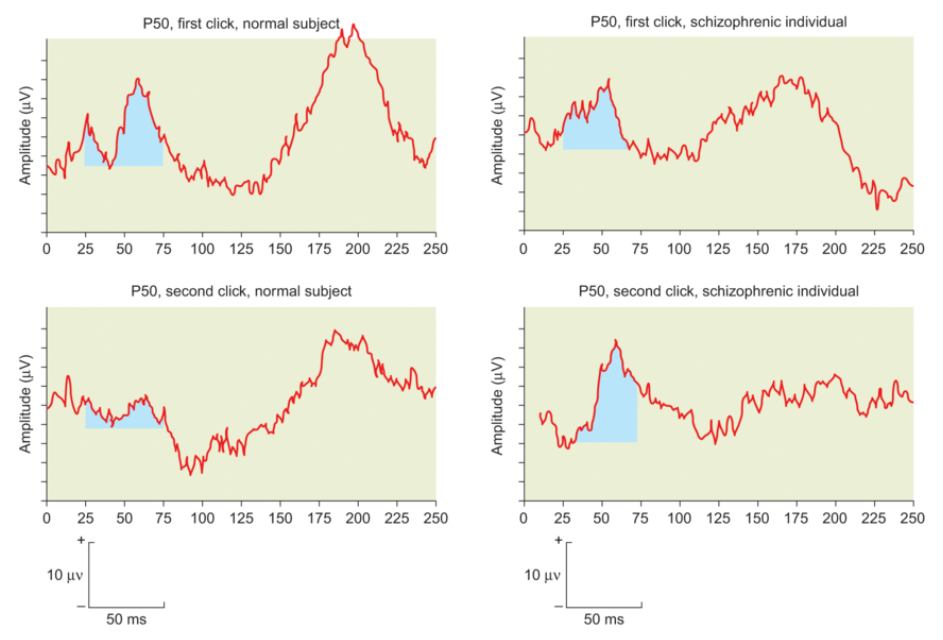

Sensory gating can be measured through an early event-related potential, the P50, which occurs within 50 ms following an auditory stimulus like a click. The reduced P50 response to the second stimulus in a paired sequence is thought to represent an inhibitory process that allows very early attentional selection within the auditory system (see Figure 14.5). Many studies have demonstrated that this inhibition effect is absent in schizophrenics, indicating a disturbance in sensory gating (e.g., Hazlett et al., 2015; Owens et al., 2016; Patterson et al., 2008).

感觉门控可以通过早期的事件相关电位P50测量，P50在像咔嚓声的听觉刺激的后50ms发生。对于在配对序列中的第二次刺激的减弱的P50响应被认为是代表了一种抑制过程，这个过程允许非常早期的在听觉系统的注意选择（见图14.5）。许多研究已经显示这个抑制效应在精神分裂症中是缺失的，表明在感觉门控中的扰乱。

Figure 14.5 Deficits in sensory gating in schizophrenia.
In normal people (left panels), the neural response evoked by the second click (bottom row) in a pair of auditory clicks is reduced, compared to the response to the first click (top row). This reduction in response is not observed in people with schizophrenia (right panel), indicating deficient gating of sensory information.

图14.5精神分裂症感觉门控的缺陷

在正常人（左图）中，由在一对听力敲击的第二次敲击（下行）的神经响应是被减弱的，相较于第一次敲击的响应（上行）。响应的减弱在精神分裂症患者中（右图）没有被观察到，表明在听觉信息门控中的缺陷。

Another electrophysiological abnormality that has been clearly demonstrated in schizophrenia is a reduced P300 response to stimuli, particularly in the auditory domain (Ford, 1999; Turetsky et al., 2015). Figure 14.6 depicts this phenomenon. As discussed in Chapter 3, the P300 is an event-related potential that is elicited when a person must pay attention in order to detect a specific task-relevant stimulus within a stream of stimuli. It is thought to represent a process related to the updating of information in working memory. Schizophrenic patients tend to have a reduced P300 over many brain regions, but particularly over the left temporal lobe. This functional deficit may result from less gray matter in the region that generates the P300 response, as patients with a relatively smaller left planum temporale tend to also exhibit a relatively smaller left-sided P300 response to auditory stimuli (McCarley et al., 2002). Notably, a smaller P300 response over the left superior temporal gyrus predicts more severe positive and negative symptoms (Kawasaki et al., 2007). These results imply that the reduced P300 and the reduced left-sided volumetric findings may reflect a common pathology that contributes to the clinical presentation of the disorder.

在精神分裂症中的另一种已经被清除揭示的电生理异常是对于刺激的P300响应的减弱，特别是在听觉领域中。图14.6描述了这一现象。正如在第三章中讨论的，P300是一种当一个人必须付出注意力来探测一个在一系列刺激中与具体事件相关的特别刺激的事件相关电位。它被认为代表与工作记忆中的信息更新有关的过程。精神分裂症患者倾向于有在许多脑区中都有减弱的P300，但是在颞叶处更加明显。这个功能缺陷可能是由于这个区域有更少的可以产生P300响应的灰质，因为具有相对较小左颞平面的病人也倾向于对于听觉刺激有相对小的P300响应。值得注意的是，左颞上回的较小P300响应预测了更加严重阳性与阴性症状。这些结果表明减弱的P300与减小的体积的发现可能反映了导致疾病的临床表现的通常病理。

Figure 14.6 Reduced P300 component in schizophrenia.
Stimuli that normally produce a large P300 peak in the ERP waveform do not do so in people with schizophrenia.

图14.6 精神分裂症中减弱P300的部分。

刺激正常会在事件相关电位的波形中产生更高的P300峰值，这在精神分裂症患者中不会发生。

Electrophysiological measures of altered semantic processing in schizophrenia also provide evidence of temporal lobe dysfunction. Disorganized thinking is a clinical symptom of the disorder, and **it can take the form of very loose associations between concepts, leading to incoherent speech**. Consistent with this clinical symptom, cognitive studies have found abnormalities in [**semantic priming**](https://www.apa.org/pubs/highlights/peeps/issue-33) in schizophrenia. In semantic priming tasks, participants have to decide quickly whether a particular item is a word or a nonword, and they are faster to do so when the target item is preceded by a semantically related prime. For example, participants are faster to decide that “NAIL” is a word if they have just been primed with “HAMMER” rather than an unrelated word such as “APRICOT.” When there is a delay between the prime and the target, people with schizophrenia tend to show reduced priming (Minzenberg et al., 2002). However, other studies have revealed “hyperpriming” in people with schizophrenia when primes are followed quickly by targets (e.g., Safadi et al., 2013). Together, the abnormally enhanced priming at short delays and reduced priming at long delays imply alterations in the spread of activation between associated mental concepts, making some associations stronger than normal and others weaker than normal.

在精神分裂症中改变语义处理的电生理学测量也提供了颞叶功能障碍的证据。混乱的思维是该疾病的临床症状，并且它能采取各个概念之间松散的关联，导致语言的不连贯。与这种临床病症一致，认知研究已经发现精神分裂症患者的[语义启动](https://baike.baidu.com/item/%E8%AF%AD%E4%B9%89%E5%90%AF%E5%8A%A8%E6%95%88%E5%BA%94/22321920?noadapt=1)异常。在语义启动任务中，被试快速判断一个东西是一个词汇还是一个非词汇，他们会在前一个是语义相关启动时完成的更快。例如，被试很快判断出“钉子”是一个词，如果前一个词是“锤子”而不是无关的词汇例如“杏”。当启动子与目标间有延迟时，有精神分裂症的患者倾向于有减弱的启动效应。然而，当目标在启动子后很快呈现，其他研究已经揭示了具有精神分裂症患者的“超启动效应”。总的来说，在短延迟异常强化的启动效应和长延迟减弱的启动效应意味着想过心理概念间激活的扩散改变，使得一些关联变得比正常更强而另一些变得比正常更弱。

**Semantic priming** refers to the observation that a response to a target (e.g., dog) is faster when it is preceded by a semantically related prime (e.g., cat) compared to an unrelated prime (e.g., car). Semantic priming may occur because the prime partially activates related words or concepts, facilitating their later processing or recognition. Although this process is often automatic, priming can also be guided by the use of specific strategies to achieve a particular task goal. For example, one could prospectively generate a number of potential targets based on the prime, or retrospectively check whether the target is related to the previously displayed prime.

