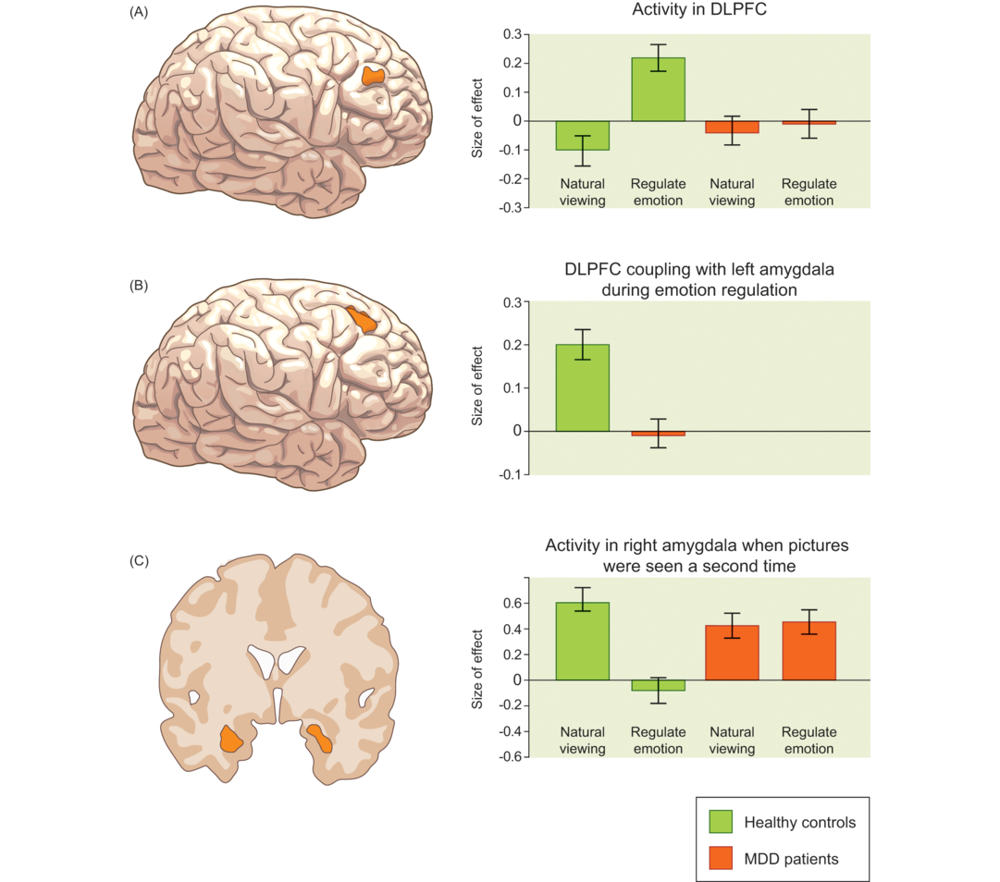
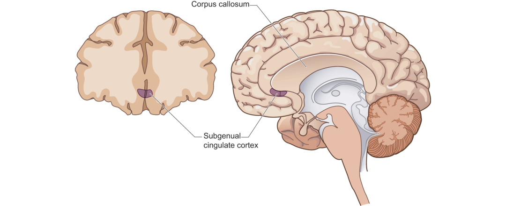

Frontal lobe control systems are also important in emotion regulation, as we reviewed in Chapter 12. In one study, patients with depression and matched nondepressed participants viewed upsetting pictures and were either told to experience emotions naturally or told to attempt to view the pictures as a “neutral observer,” a form of emotion regulation involving cognitive reappraisal (Erk et al., 2010). During the emotion regulation condition, depressed participants did not show the increase in activity in DLPFC that was present in control participants (see Figure 14.9A). Depressed participants also showed less functional connectivity between the amygdala and DLPFC, compared to controls, during active emotion regulation (see Figure 14.9B). About 15 minutes later, participants viewed the same pictures again without any specific instructions. In control participants, amygdala activation was reduced while viewing negative pictures for which they had previously practiced emotional regulation, whereas that evidence of emotion regulation was not evident in the depressed participants (Figure 14.9C). Together the results imply that in people with depression, top-down control mechanisms may not be engaged as they should be during attempts to regulate emotion.

前额控制系统在情绪调节中也有重要的作用，正如我们在第十二章中看到的。在一项研究中，患有抑郁症的人和与他们相匹配的没有抑郁的被试观看令人难受的图片并被告知自然而然地体会图片中的情绪或者作为“中立观察者”审视这些图片，这是一种涉及认知重评的情绪控制方式。在情绪调节条件下，抑郁的被试没有显示DLPFC中活动的增加，而控制组的被试发生了DLPFC活动的增加（见图14.9A）。抑郁的被试在进行情绪调节期间也显示了相较于控制组更少的杏仁核与DLPFC间的功能连接（见图14.9B）。大约15分钟后，被试在没有具体指示的情况下再一次观看图片，此时在抑郁被试中情绪调节（与正常被试脑区反应不同）的证据不那么明显了（图14.9C）。综合这些结果表明有抑郁的人，自上而下的控制机制可能在尝试调节情绪时并没有参与其中。

Figure 14.9 Disruption of neural activity during emotion regulation in depressed participants.

图14.9 抑郁被试情绪调节时神经活动的分裂。

Patients with major depressive disorder (MDD) were compared to control participants during a task in which they viewed unpleasant pictures and were instructed to either view the pictures naturally or to cognitively reappraise the pictures in more neutral terms. For control participants, the instruction to regulate emotions led to increased activity in the DLPFC, but this pattern was not evident in the MDD participants (panel A). Furthermore, during active emotion regulation, control participants showed heightened functional connectivity between the DLPFC and the amygdala, a pattern that was absent in the MDD group (panel B). Finally, activity in the amygdala during a subsequent viewing task was reduced for those pictures that had been previously cognitively reappraised, compared to those that had been naturally viewed, for the control group only; the effects of prior emotional regulation upon subsequent amygdala response to the pictures was absent in the MDD group (panel C).
(from Erk et al., 2010)

有重度抑郁症的患者与控制组被试在观看不悦图片并被指示自然观看图片或者以更中性的方式对图片进行认知上的重新评估的任务时的对比情况。对于控制组被试，情绪调节指示导致DLPFC活动的增加，但是这一模式在MDD患者中不明显（分图A）。更进一步，在激活情绪调节期间，控制组被试展示了DLPFC与杏仁核间更强的功能连同性，MDD组缺乏这一模式（分图B）。最后，对于那些之前已经进行过认知重评的图片与自然观察的图片，仅仅对于控制组而言，在后续观察任务中杏仁核的活动减少了；先前情绪调节效应在后续观察图片时的杏仁核响应在MDD组中没有显现（分图C）。

Another aspect of frontal lobe functioning that has been consistently related to depression involves hemispheric asymmetries of brain activation. Using EEG methods that measure activity in resting states, numerous studies have demonstrated greater right than left frontal activity among depressed participants (Davidson et al., 2002; Thibodeau et al., 2006). For example, people with depression exhibit reduced activity in the left frontal region when anticipating a reward, implying a failure to engage the [**approach system**](https://thebrain.mcgill.ca/flash/capsules/pdf_articles/behavorial.pdf)(BAS) that is indexed by left-hemisphere activity (Shankman et al., 2007). Moreover, right-greater-than-left frontal activity is consistently observed among people who are at risk for a depressive episode, such as adolescents with a family history of depression or infants of depressed mothers (Dawson et al., 2001; Diego et al., 2004; Tomarken et al., 2004). These findings indicate that asymmetric activation of frontal regions, as measured with EEG, may be a marker of susceptibility to depression.

额叶的另一面一直与抑郁有关的功能涉及脑激活的半球非对称性。采用EEG方法测量精细状态的活动，大量的研究已经显示在抑郁症患者中右脑活动强于左脑活动。例如，当期望奖励时，患有抑郁症的人在左额叶区域有减弱的活动，表明不能使用左半球活动标识的**趋近系统**。此外，右强于左的脑活动是与观察到的有抑郁风险时期的人的脑活动一致，例如由家族抑郁症病史的青年人或者有抑郁症母亲的婴幼儿。这些发现表明前额区域非对称的活动，如EEG中测量的，可能是疑似抑郁症的标志。

An additional frontal region has been implicated specifically in treatment-resistant depression, that is, depression that does not improve following standard treatments. The relevant region is the subgenual region of the anterior cingulate cortex, illustrated in Figure 14.10. This region is highly interconnected with other regions involved in emotion, such as the hypothalamus, which controls the body’s stress responses, and the insula, which represents bodily states. Dysregulation in the subgenual cingulate cortex may be especially related to the somatic and vegetative symptoms of depression. High activity in this region in a resting state in someone with depressive symptoms appears to predict poor response to typical treatments for depression, prompting the search for alternative treatments (Dunlop and Mayberg, 2014). Such findings indicate the potential for cognitive neuroscience approaches to identify participants who would benefit from particular kinds of treatment based on pre-treatment brain activity.

额叶的另一个区域特别与治疗顽固型抑郁症有关，治疗顽固型抑郁症是指依照标准治疗方法没有改善的抑郁症。相关的区域是前扣带皮质的下膝状区域，如图14.10所示。这一区域与其他涉及情绪的区域高度相连，例如下丘脑，控制身体压力响应和脑岛，代表身体状态。扣带皮质下膝状区域的失能可能与抑郁的躯体和植物性症状有关。患有抑郁症的人在静息状态下这一区域的高度活动似乎预测了对于抑郁症典型治疗方法的糟糕效果，促使搜寻另一方法。这些发现表明，认知科学方法对于基于治疗前大脑活动的进行特别治疗使患者受益的潜能。

Figure 14.10 Subgenual region of the prefrontal cortex that is implicated in depression.

图14.10 涉及抑郁的前额皮质的下膝状区域

This region shows increased activity in depressed compared to nondepressed people. Furthermore, activity in this region decreases when therapeutic interventions, such as antidepressant drugs or [**electroconvulsive therapy**](https://www.mayoclinic.org/tests-procedures/electroconvulsive-therapy/about/pac-20393894)(ECT), are effective.

相较于非抑郁人群，该区域在抑郁人群中活动增加。更进一步，当进行治疗干预，例如抗抑郁的药物和电休克疗法有效时，该区域活动增加。
