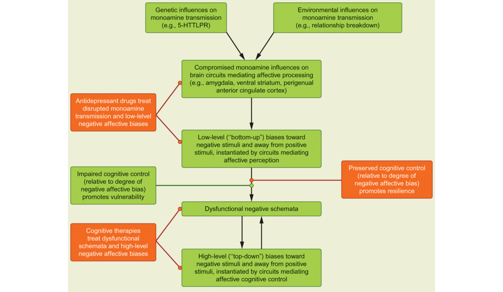

### Therapeutic Interventions

Treatment for depression typically involves intervention at either the cognitive or the biological level, or both in combination. Cognitive therapy consists of identifying self-defeating and pessimistic thought patterns in depression and trying to alter those ways of thinking. Biologically based interventions often involve treatment with medication. Both cognitive therapy and antidepressant medication are relatively effective in treating depression in many people (Kamenov et al., 2017). In addition, treatment methods based on noninvasive stimulation of the brain have been developed in recent years. In the following sections, we review what is known about the neural mechanisms involved in the treatment of depression and consider novel treatments that have been developed based on cognitive neuroscience findings.

对于抑郁症的治疗通常涉及认知或生理层面的干预，或者是两者的结合。认知治疗包括确认出抑郁症中的自我挫败和悲观思维模式并改变这些思考的方法。依据生理的敢于经常涉及药物的治疗。认知治疗和抗抑郁药物对于许多人群，来治疗抑郁症都是相对有效的。另外，根据非侵入性大脑刺激的治疗方法在近些年已经得到发展。在下面及部分中，我们回顾已知的涉及治疗抑郁症的神经机制并考虑依据认知神经科学发现的最新疗法。

### How Standard Treatments for Depression Affect the Brain

Depression is often treated with drugs that affect the [monoamine neurotransmitter](https://www.health.gov.au/internet/publications/publishing.nsf/Content/drugtreat-pubs-modpsy-toc~drugtreat-pubs-modpsy-2~drugtreat-pubs-modpsy-2-3~drugtreat-pubs-modpsy-2-3-intr) systems of the brain (see Chapter 1). Typical drug treatments include [serotonin-selective reuptake inhibitors (SSRIs)](https://en.wikipedia.org/wiki/Selective_serotonin_reuptake_inhibitor), such as fluoxetine (Prozac) and escitalopram (Lexapro), which target the serotonin systems that are spread throughout the brain. Some other antidepressant drugs affect other monoamine neurotransmitter systems, such as the norepinephrine and dopamine systems (Iosifescu et al., 2013).

抑郁症通常用影响大脑的**单胺类神经递质**系统（见第一章）。通常药物治疗包括5羟色胺重摄抑制剂，例如氟西汀（百忧解）和艾司西酞普兰（依他普仑），靶向大脑中分布的5-羟色胺系统。一些其他的抗抑郁药物影响单胺类神经递质系统，例如去甲肾上腺素和多巴胺系统。

Although these drugs are well characterized at the molecular level – meaning that their immediate effects on the synapse are well understood – it is not yet clear exactly how or why they make depressive symptoms better. One possibility is that they restore a normal balance of neurotransmitter function through long-term changes in receptor sensitivity (e.g., Duman, 2009). Another proposal is that these drugs may produce their therapeutic action by stimulating neurogenesis or other aspects of nerve cell growth (e.g., Hill et al., 2015; Sahay and Hen, 2007; Santarelli et al., 2003). Regardless of the precise mechanism of action at the cellular level, neuroimaging studies indicate that pharmacological treatment of depression tends to reduce the response of the amygdala to negative information, while increasing prefrontal cortex responses (Wessa and Lois, 2015).

虽然这些药物在分子层面刻画得很好-意味着它们对于突触的直接影响是得到很好了解的-还不清楚它到底是如何以及为什么使得抑郁症状减轻。一种可能是它们通过对于受体敏感性的长期变化恢复了神经递质功能的正常平衡。另一种提议是这些药物可能通过刺激神经细胞生长和其他方面的神经细胞增长产生它们的治疗功效。无论细胞层面的准确机制是怎样的，神经影像学研究表明抑郁症的药物治疗倾向于减轻杏仁核对于负面信息的反应，同时增加了前额叶的反应。

A cognitive neuroscience framework may help to bridge the gap between biochemical and psychological models of depression. For example, Figure 14.11 presents an integrated model of depression that incorporates many levels of analysis, from neurochemical through cognitive features, and also illustrates the possible points of intervention targeted by pharmacological therapy and cognitive therapy (Roiser et al., 2012). According to this model, antidepressant drugs may work by influencing relatively low-level neural systems that create biases toward negative (unpleasant or threatening) stimuli in the environment (such as unfriendly faces or negative words), whereas cognitive therapies may work to address higher-level mental schemas or belief systems that are known to be maladaptive in depression (such as the depressed person’s belief that things will never get better or that he or she is generally inadequate). Although there is still much to be worked out in such a model, it moves away from an “either/or” conception of drug versus cognitive therapy and allows for the possibility that both are effective through somewhat different neurocognitive mechanisms.

一种认知神经科学框架可能帮助搭建抑郁的生物化学和心理学模型间的桥梁。例如，图14.11展现了包括从神经化学到认知特征的许多层面分析抑郁的整合模型，并且阐述了药物治疗和认知治疗所针对的可能干预点。根据这个模型，抗抑郁的药物可能通过影响相对低层面的神经系统，这些低层面的神经系统创造了对于环境中负面（不开心或者威胁）刺激（例如不友好的面孔或者负面词汇），而认知治疗可能通过处理已知在抑郁中不适的高层面心智模式或者信仰系统起作用（例如抑郁的人信仰事情永远不会编号或者他或她通常是不足的）。虽然对于这个模型还有许多事情要做，它远离了药物和认知治疗两者择一的概念并且允许两者通过某种不同的神经认知过程都有效的可能。

Figure 14.11 An integrated model of depression.

图14.11 抑郁的整合模型。

Green boxes indicate factors that increase vulnerability to depression, and orange boxes indicate factors, including treatments, that increase resilience against depression.

An exciting area of current research involves using imaging methods, and other biological markers, to identify which people exhibiting symptoms of depression are most likely to respond well to treatment. Knowledge gained in this area could ultimately have significant benefits, as physicians and psychologists could target specific drug or psychological treatments to the patients most likely to benefit from them, rather than using a “trial-and-error” approach to choose between possible treatments for individual patients. Some research suggests that brain imaging methods may be useful in this regard. For example, a recent meta-analysis found that people with higher baseline levels of activity in the anterior cingulate cortex were more likely to show clinical improvement with traditional drug or psychotherapeutic treatments for depression (Fu et al., 2013). Conversely, the same study found that participants with higher baseline activity in the insula and striatum were less likely to respond well to such treatment. Although our knowledge in this area is still incomplete due to limitations in existing studies (Phillips et al., 2015), the possibility of individually tailored treatment approaches based on patterns of brain activity is a promising avenue for future research.

当前研究的一个令人激动的领域涉及采用影像方法，和其他生物标记，来识别人们经历的抑郁症状用哪种治疗最好。这个领域获得的知识最终有显著的好处，如生理学家和心理学家可以用对于病人最有益的药物而不是采用“尝试和犯错”方法来选择对于单个病人可能的治疗方法。一些研究表明脑成像方法可能在这方面起作用。例如，左近的一个荟萃分析发现在前扣带皮质具有更高基线活动的人更可能通过传统药物或者心理治疗取得抑郁的临床改善。相反，相同的研究发现在脑岛有更高基线活动的被试可能对于这些治疗没有效果。虽然我们对于这个领域的只是由于现存研究的限制仍旧不完整，依据大脑活动对个体量身定做的治疗方法的可能性仍旧是未来研究充满希望的途径。

